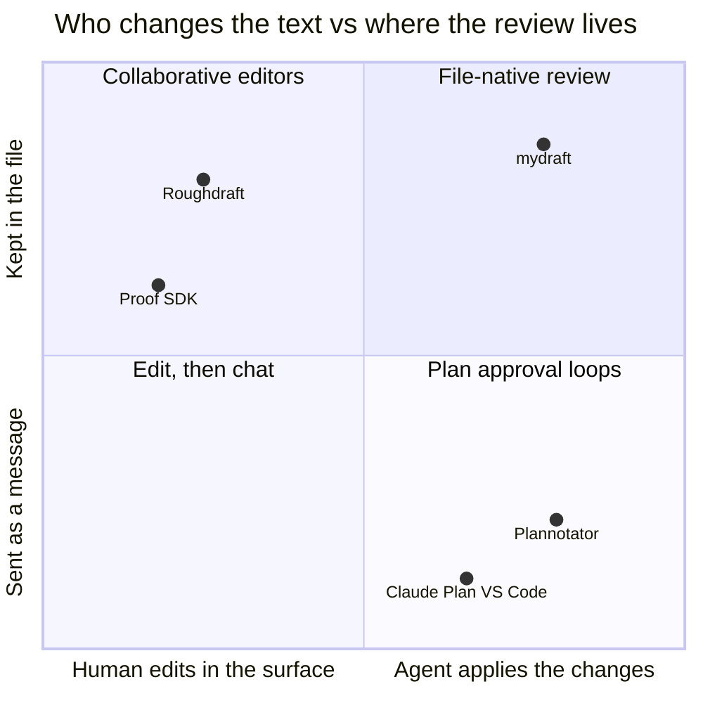

# mydraft

Review Markdown with your coding agent. The agent writes a plan, spec, or explainer to disk and runs `myd view`; you read it rendered — Mermaid, math, charts, highlighted code — and comment on any sentence, diagram node, chart mark, or block. Clicking **Done Reviewing** hands it back, and the agent answers each comment and revises through the `myd` CLI.

Everything stays in the `.md` file: comments, suggestions, and replies are stored as [CriticMarkup](https://fletcher.github.io/MultiMarkdown-6/syntax/critic.html) plus a YAML endmatter, the same on-disk format as [Roughdraft](https://github.com/Lex-Inc/roughdraft). Nothing is uploaded; the server runs on localhost.

mydraft is a viewer with an annotation layer, not an editor: the page is rendered one way from the file, so a review never reformats your Markdown. Text changes are proposed as suggestions or made by the agent with guarded block edits ([ADR 0001](docs/decisions/0001-viewer-not-editor.md)).



Editors such as Roughdraft let you type into the document, so they rewrite the whole file on every save. Plan-approval tools such as [Plannotator](https://github.com/backnotprop/plannotator) send your feedback to the agent as a message, so it isn't kept with the document. mydraft keeps the review in the file and lets the agent make the changes, so threads survive into git and into the next round. See [the positioning notes](docs/research/annotator-vs-editor-positioning.md).

## Install

Paste this into Claude Code or Codex:

```text
Install mydraft for me with `npm i -g mydraft`, then run `myd install-prompt` and use the myd skill it installs whenever I ask to review a document.
```

Or do it yourself (Node 22 or newer):

```bash
npm i -g mydraft          # or: bun add -g mydraft
myd install-prompt        # adds a short myd block to ~/.claude/CLAUDE.md and ~/.codex/AGENTS.md and links the myd skill
myd view notes/plan.md    # opens the review in your browser
```

`myd install-prompt --remove` undoes the setup; `--claude` or `--codex` limits it to one agent, and `--file F` targets any other instruction file. `myd shot` needs Chrome or Chromium on `PATH`, and `myd diff` needs `python3`.

## The review loop

1. The agent writes or updates a Markdown file, runs `myd view FILE`, and ends its turn. In Claude Code it runs `myd view FILE --wait --timeout 0` as a background command instead, so your Done wakes it without you returning to chat.
2. You comment on a selection, a diagram node, a chart mark, or a whole block; propose replacement text as a suggestion; then click **Done Reviewing**, optionally with an overall note.
3. The agent runs `myd comments FILE`, replies (`myd reply`), revises (`myd set-block`, `myd insert`), resolves (`myd resolve`), and hands the document back with `myd view` again.

`myd help` lists every command, `myd help <command>` shows one, and `myd guide <topic>` explains the concepts. Every command takes `--json`.

## Working from a checkout

From a checkout, `myd` runs the TypeScript directly on [Bun](https://bun.sh) with no build step:

```bash
bun install && bun src/cli.ts install-prompt
bun test                  # unit tests; bun run test:e2e drives a real browser
npm run build             # compile dist/ for the published package (npm pack runs it)
```

From a checkout, `install-prompt` also links `~/.local/bin/myd` → `<checkout>/src/cli.ts` (`--bin-dir DIR` to put it elsewhere; it warns if the directory is not on `PATH` and never overwrites a `myd` it did not create), and symlinks `skill/` rather than copying it. Nothing depends on where the checkout lives; after moving it, run `install-prompt` again from the new location.

The roadmap is [`plans/roadmap.md`](plans/roadmap.md). `bin/rd-open`, `bin/rd-shot`, and `bin/rd-diff` are the original helpers for driving Roughdraft itself; `myd diff` still uses `rd-diff`.

## Rich documents

Rich documents can also use an `explainer` fence for native, responsive timing/measurement/result layouts. Authored object IDs become precise annotation targets. Agents can inventory and surgically revise those same `block›target` objects with `myd objects`, `myd object`, and `myd set-object`; the full fence is validated before a guarded write. Sandboxed `html` fences remain available for one-off visual work; elements marked with `data-myd-id="…"` can report their identity and selected text through myd's narrow annotation bridge.

## Publish an immutable release

`myd publish` composes the existing standalone exporter with a small local release transaction:

```bash
myd publish notes/wip.md --profile research
```

By default it writes `.myd-publish/wip/` beside the source document. These local generated archives are ignored by Git; `--output-dir DIR` overrides the location. Each successful run creates an immutable bundle under `releases/<timestamp>-<source-hash>/` containing `source.md`, `index.html`, and `manifest.json`. The root `index.json` points to the current release and lists prior bundles newest-first.

Publish v0 checks for server-rendered rich-block errors before committing. A failed check leaves the previous index and releases untouched. Concurrent publishes fail fast through `.publish.lock`; myd never deletes a pre-existing lock automatically, so a stale lock must be inspected and removed explicitly. Model references, links, screenshots, contrast, and responsive-layout checks remain promotion gates for later slices; the manifest does not claim they ran.

## Review from another device

`myd view` prints a `localhost` URL and opens a browser on the machine running the server, which is wrong when the reviewer is elsewhere or the box is headless. Configure a public origin instead:

```bash
export MYD_PUBLIC_URL=https://review.example.test    # or: myd serve --public-url https://review.example.test
myd view plans/roadmap.md --wait
# https://review.example.test/review/6f1b…
```

The review is still created and tracked over localhost; only the printed origin changes, and no desktop browser is launched. Put an HTTPS reverse proxy or tunnel in front of the port — the viewer already speaks root-relative HTTP and derives `wss://` from the page, so nothing needs host rewriting. That is also why a public URL carrying a path prefix is rejected rather than printed: the viewer loads `/web` and `/api` from the origin root. Prefer `https://`: an `http://` origin is accepted for a LAN or a test, but the document text and every annotation then travel in cleartext.

Remote review is a property of the deployment, so `myd serve --public-url` records the origin and later `myd view` calls in other shells pick it up. `MYD_PUBLIC_URL` in the calling process wins; setting it empty takes one call back to local. The URL carries only the opaque review id — the same `/review/<id>` route the local viewer uses.

> **Anyone who can reach the origin can reach every review on that server.** The root route is the Review Inbox: it lists every review with its id, and any id opens, annotates, or completes that review. The id is six characters and therefore guessable, and it keeps the *file path* off the wire rather than scoping access to one document — and sharing one review link is closer to handing out an account than a single-document link. So restrict the proxy to people you trust with every document under review on that machine; authenticating them is not the same as scoping them. When a review needs a narrower audience, give it its own instance with `MYD_HOME` and `MYD_PORT`.

`myd view` runs a browserless structural check first — parse errors, duplicate ids, invalid Mermaid/explainer/chart fences and error-block renders stop it with a `file:line` diagnostic and exit 2 before any review is created; warnings print and it opens anyway. `myd check FILE [--json]` runs the same check on demand, and `myd view --skip-check` opts out. It is structural only: `myd shot` remains the way to check layout and final pixels.

Env: `MYD_PORT`, `MYD_HOME` (state dir) run an isolated instance; `MYD_PUBLIC_URL` enables remote review; `MYD_NO_OPEN=1` suppresses the browser (a browser that cannot be launched is a warning, not a failure — the review is still created and `--json` reports `browserOpened`/`browserError`) — the eval runner uses all three (`:7575`, `~/tmp/myd-eval/.myd-home`).

Agent integration (three rungs, all installed idempotently by `myd install-prompt`): `docs/prompt.md` → ~100-word always-loaded pointer in `~/.claude/CLAUDE.md` + `~/.codex/AGENTS.md` (marker-delimited); `skill/` → symlinked to `~/.claude/skills/myd` + `~/.codex/skills/myd` (SKILL.md workflow, references/agent-guide.md); `myd help` (command index), `myd help <command>` / `myd <command> --help` (flags, guards, one example), and `myd guide <topic>` (concepts) from the CLI. From a checkout it also links the `myd` launcher (see Working from a checkout). `--remove` uninstalls all; `--file F` targets any other agent file.

## Credits and license

mydraft reuses Roughdraft's review format and ships its compiled `rfm` parser unmodified in [`vendor/rfm/`](vendor/rfm/) (MIT, © Lex, Inc. and Nathan Baschez; see [`vendor/rfm/LICENSE`](vendor/rfm/LICENSE)). Roughdraft was created by Nathan Baschez; mydraft is an independent project and is not affiliated with or endorsed by Lex.

mydraft is released under the [MIT License](LICENSE).
