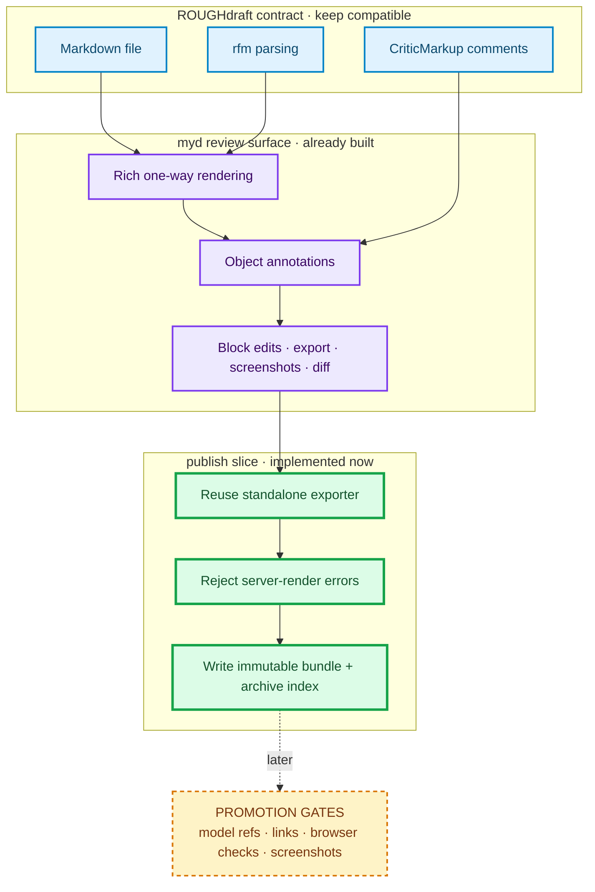
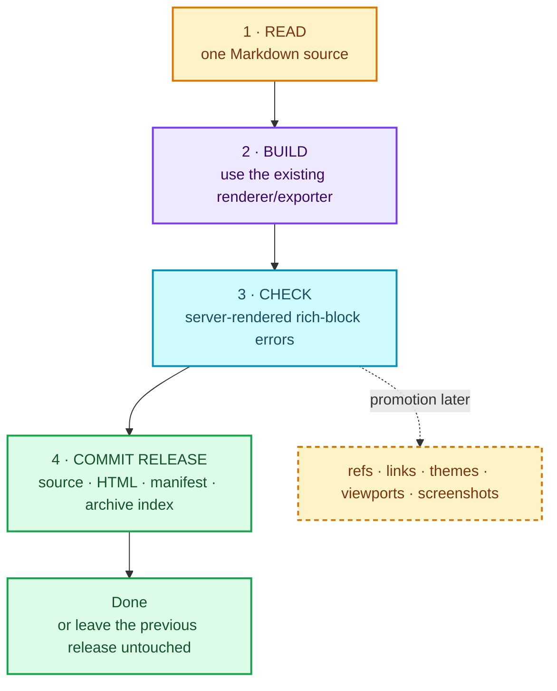

# How this plan extends Roughdraft—without swallowing it {#title}

> [!IMPORTANT]
> **Verdict:** this is not a plan to keep extending Roughdraft's editor. `myd` keeps the useful Roughdraft contract—Markdown files, CriticMarkup review data, and the `rfm` parser—then adds a one-way visual review and release workflow around that contract. `myd publish` should be a thin coordinator over tools that mostly exist already.

```explainer {#complexity-check}
theme: aurora
eyebrow: Scope check
title: A thin release seam, not a second document platform
lede: Comment on any card below if its boundary feels unconvincing.
sections:
  - type: measurements
    id: ownership
    title: Where the responsibilities live
    cards:
      - id: roughdraft-contract
        label: Reused from Roughdraft
        value: File + review format
        status: measured
        provenance: CriticMarkup and rfm
      - id: myd-core
        label: Already working in myd
        value: Render · annotate · export
        status: measured
        provenance: Current code and test suite
      - id: publish-glue
        label: Implemented publish slice
        value: Render · record · archive
        status: derived
        provenance: Existing exporter + release transaction
  - type: result
    id: scope-verdict
    label: Complexity verdict
    value: Bounded
    status: derived
    caveat: The current slice is one synchronous local command. Model refs and browser checks remain explicit promotion gates.
```

## The boundary in one picture {#boundary}



The extension point is **after review, before release**. Roughdraft compatibility remains below it; the renderer and annotation model remain unchanged beside it. Publishing does not require a new editor model, a database, or a new document format.

## What the implemented command does {#command}



In implementation terms, v0 should look roughly like this—not like a workflow framework:

```ts
async function publish(source, profile) {
  const release = await buildWithExistingMyd(source, profile);
  assertNoServerRenderErrors(release);
  await commitReleaseAtomically(release);
  return release.manifest;
}
```

The “read” and “commit release” phases are the only places that should know archive layout. The renderer should not know it is publishing, and the archive should not know how Markdown is rendered.

## Existing, new, and deliberately excluded {#scope-table}

| Capability | Treatment in publish v0 |
|---|---|
| Markdown parsing and CriticMarkup | **Reuse unchanged** |
| Rich rendering and standalone HTML | **Reuse unchanged** |
| Immutable source/HTML/manifest bundles and archive index | **Implemented now** |
| Object IDs and semantic explainer diff | **Existing capability; publish integration deferred** |
| Screenshot capture | **Deferred promotion gate** |
| Resolve explicitly declared model-result references | **Deferred promotion gate** |
| Release manifest and recoverable archive transaction | **Small new module** |
| Scientific truth checking | **Excluded**—check traceability and exact values only |
| WYSIWYG editing, A2UI, recipe registries, background jobs | **Excluded** |
| General-purpose build graph or plugin framework | **Excluded** |

> [!NOTE]
> The HTML-island screenshot limitation stays visible. Native explainers can be a publish-v0 requirement; arbitrary HTML may carry a reduced-guarantee warning until iframe-aware capture is reliable. We do not need to solve every rendering mode to ship the first useful command.

## The anti-overengineering contract {#tripwires}

Pause or shrink the design if any of these become necessary for v0:

- a persistent service or database;
- a general job scheduler, dependency graph, or plugin protocol;
- a second rendering implementation instead of calling the existing exporter;
- implicit scanning of arbitrary model files rather than explicit declared references;
- migration away from Roughdraft-compatible Markdown and CriticMarkup;
- more than one real research profile before the first end-to-end release succeeds.

Conversely, v0 earns the right to grow only after one real research explainer demonstrates all four outcomes:

1. A changed model result updates the intended named visual object.
2. A reviewer can annotate that object and the agent can patch its source.
3. Failed checks preserve the previous release untouched.
4. The archive explains exactly what inputs and tool versions produced the release.

## What happens next {#next}

The high-level design is settled, and the first implementation slice now exists. The next evidence-bearing steps are:

1. Exercise `myd publish` on one real model-backed explainer.
2. Add declared model-reference resolution and exact-value traceability.
3. Add browser checks and screenshots as their own manifest entries.
4. Generalize only when that real release exposes a concrete repeated need.

> [!TIP]
> If this document does not make the boundary feel small, comment on the specific card, diagram node, table row, or sentence that still looks like a platform project. That is the part to simplify before implementation.
