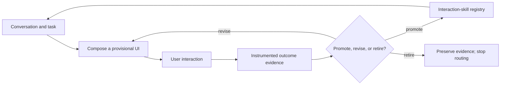

# Interaction Skill Garden: Harness Self-Improvement {#interaction-skill-garden}

**Interaction Skill Garden** is a form of harness self-improvement in which an agent learns reusable, domain-aware interaction patterns from repeated collaboration with people. The base model may remain fixed while the harness externalizes successful interaction strategies as versioned assets that alter what the agent can offer in future sessions.

It is deliberately not a system that merely generates a fresh UI for every prompt. It lets an agent turn successful interaction patterns into maintained assets: compose them for a new situation, observe their outcomes, improve them with evidence, and eventually reuse them across sessions and domains.

## The central proposition {#proposition}

The interesting unit of learning is not just a UI component. It is an **interaction skill**: a reusable package that knows what it is for, when to offer itself, how it is rendered, which state and events it owns, and how its usefulness is evaluated.

A travel agent might first compose a one-off flight-comparison view. If users repeatedly sort by the same trade-off, expand the same details, or perform the same follow-up action, the agent may recognize a durable pattern: “compare itineraries under time, price, and disruption constraints.” That pattern can become an interaction skill. The same structural skill may later help with choosing insurance plans, vendors, or apartments, even though the domain data changes.

## Promotion is earned {#promotion}

> Promotion needs a contract and evidence that it improved real tasks. If the promoted artifact contains executable code, it also needs an appropriate isolation boundary.

An agent can compose trusted UI primitives freely, but a novel interaction should begin as a provisional artifact. A declarative interaction recipe becomes reusable after it has a stable contract and evidence of utility. Sandboxing is not intrinsically part of promotion; it is a security measure for the narrower case where an artifact introduces executable behavior outside the trusted renderer.

1. **A contract:** a typed rendering/data schema, explicit input and event semantics, accessibility requirements, and a clear ownership boundary for state.
2. **Evidence:** measured improvement in real task outcomes or calibrated behavioral proxies, not merely the model's judgment that the artifact looks sensible.
3. **An execution boundary, when needed:** agent-authored executable components must run with capabilities proportionate to their risk until they receive engineering and security review. Declarative recipes assembled from trusted primitives do not require a separate sandbox.

The registry should version skills, record where they were used, route only to candidates that fit, and deprecate skills that consistently fail to help. A garden grows, but it is also pruned.

## Instrumentation is the learning substrate {#instrumentation}

Well-instrumented UI makes implicit user behavior usable as evidence. The core research problem is to discover heuristics with useful precision and recall: some may generalize across domains, while others may depend on the type of UI element or interaction. Domain-specific outcome adapters can then add stronger evidence where the product exposes a meaningful result, such as a completed booking or accepted plan.==}{>>yeah and the challenge is to come up with domain-independent heuristics that have good recall and precision/are effective at this, or to come up with domain-specific ones for many many domains.

or perhaps it's not about domain but it's about the UI element type that strongly suggests whether it was useful or not.<<}{#c4}

- **Adoption:** whether an element is opened, changed, acted on, or ignored when it is relevant.
- **Interaction shape:** repeated sequences of filtering, comparing, expanding, revising, and acting. A recurring multi-step path is evidence for a candidate higher-level subcase, even when individual controls are generic.
- **Element-type evidence:** signals interpreted according to the control. Repeated range adjustments may mean a poor default; repeated comparison-column expansion may mean the dimension is valuable; immediate undo may be negative evidence.
- **Task-effect proxies:** fewer clarification turns, less backtracking, shorter time to a stable choice, fewer later reversals, and successful handoff. These are weak or delayed signals unless a domain supplies a directly observable outcome.
- **Friction:** corrections, abandoned forms, undo/backtracking, clarification requests, and switching back to prose.
- **Reuse quality:** whether selecting a stored interaction skill improves a new task relative to a matched one-off dynamic or text-only baseline.

Repetition is especially informative. Frequent use says an element may be valuable; frequent *multi-step use* says there may be a missing higher-level interaction. For example, if people repeatedly filter flights, expand baggage and layover details, then ask “which is safest if the first flight slips?”, that is evidence for a dedicated resilience-tradeoff interaction—not just three commonly used controls.

These signals are hypotheses, not truth. The harness should estimate their precision and recall against explicit feedback or downstream outcomes, and maintain separate calibration by interaction type before adding domain-specific adjustments. Evaluation must control for position bias, novelty, task difficulty, and selection effects. Instrumentation should collect the minimum event data, obtain meaningful consent, keep sensitive content separable from behavior aggregates, and never equate clicks with utility by default.

## A practical architecture {#architecture}

Three layers keep freedom and safety in balance:

1. **Trusted primitives** — tables, forms, maps, cards, filters, charts, and standard interaction controls implemented by the host.
2. **Declarative interaction recipes** — agent-authored compositions of primitives, state bindings, and event contracts. These are the main reusable artifacts.
3. **Custom executable implementations** — rare new components that require capability isolation plus engineering and security review before joining the trusted catalog.

The agent should normally learn at layer 2. That captures domain-specific value without requiring generated frontend code. A sandbox is useful only at layer 3, where it limits the authority of executable behavior while that behavior is evaluated; it is not evidence that the component is useful.

## What to call the work {#terminology}

The clearest umbrella phrase is **persistent generative UI**. The learning mechanism can be described as **continual interaction-skill learning** or **evidence-driven interaction-skill evolution**.

Useful related search terms:

- generative UI / agentic UX
- declarative agent-to-user interfaces
- persistent personal agents / lifelong agents
- continual skill learning / evolving skill libraries
- procedural memory for agents
- adaptive interfaces / end-user development

## Existing foundations and the gap {#prior-art}

The ingredients exist, but not yet as a mature end-to-end field:

- [A2UI](https://github.com/a2ui-project/a2ui) provides declarative, incrementally updatable agent-generated UI composed from a host's trusted catalog.
- [Google Generative UI and PAGEN](https://research.google/blog/generative-ui-a-rich-custom-visual-interactive-user-experience-for-any-prompt/) concern prompt-to-rich-interactive interface generation.
- [PAST-Bench](https://arxiv.org/abs/2608.04003) measures whether a personal agent improves across fresh sessions through retained experience.
- [SkillCraft](https://arxiv.org/abs/2603.00718), [SkillFlow](https://arxiv.org/abs/2604.17308), and [SkillLearnBench](https://arxiv.org/abs/2604.20087) study creation and reuse of persistent skills. {==SkillLearnBench's warning is relevant: external feedback supports real improvement; self-feedback alone can drift.==}{>>we should mine these benchmarks for heuristics on what generalizes and leads to SOTA results<<}{#c5}
- [Ratchet](https://github.com/amazon-science/Self-Evolving-Agents-Ratchet) is a useful reference for governed lifecycle management of a growing skill library.

There does not appear to be an established benchmark that jointly evaluates dynamic generative UI, repeated multi-session collaboration with a person, promotion into a persistent interaction registry, and cross-domain reuse.

## A benchmark shape {#benchmark}

Evaluate sequential episodes per user or simulated persona across several domains. Compare a static catalog, one-off dynamic composition, a persistent registry, and a registry with evidence-driven promotion and retirement. Measure task success, time and turns, corrections and abandonment, later-session reuse, inappropriate reuse, accessibility/safety conformance, and user preference. Hold out at least one domain to distinguish structural transfer from memorizing a travel widget.

## A cross-session journey {#cross-session-journey}

1. **Session one — generic comparison.** A traveler compares flights in a generic table. They repeatedly hide connecting flights, expand layover details, inspect the final flight of the day, and ask how a delay on the first leg changes the itinerary. The harness records the interaction sequence, not just clicks.
2. **Session two — candidate invention.** Similar behavior recurs on a family trip. The agent composes a declarative **connection-resilience comparison** that combines price, total duration, layover buffer, reaccommodation options, and baggage risk. The recipe is provisional and carries its contract, triggering evidence, and evaluation history.
3. **Session three — organic reuse.** On a business trip, retrieval selects the recipe because the request contains a tight arrival constraint and connecting itineraries. The user reaches a stable choice through the UI without the agent explaining each trade-off in prose or asking the same sequence of clarifying questions.
4. **Later transfer — structural test.** A held-out domain, such as supplier selection, reuses only the abstract interaction pattern—compare options under cost, timing, and failure-recovery constraints. Success here is evidence of a reusable interaction skill rather than a memorized travel component.

Token savings should be demonstrated with matched sequential runs. Compare the persistent-registry agent with an otherwise identical one-off generative-UI agent, include retrieval and recipe serialization in both cost totals, and require non-inferior task success. Report tokens avoided in repeated explanations, schema generation, and clarification turns, alongside latency and user effort. Reuse counts as an improvement only when it saves tokens or time without degrading the decision.

## Research agenda: mine skill-learning benchmarks {#benchmark-mining}

The cited continual-skill benchmarks should be mined for operational heuristics rather than treated only as related work. Extract which routing signals predict successful reuse, what forms of external feedback prevent drift, when specialization beats generalization, how skills are consolidated or retired, and which evaluation protocols distinguish genuine transfer from extra context. Translate those findings into candidate policies for interaction-skill promotion, retrieval, refinement, subcasing, and retirement, then test them against UI-specific outcomes.==}{>>could you sketch at a high level a cross-session user journey that leads to new elements being invented, and organically reused in a way that demonstrably saves tokens.<<}{#c6}

---
comments:
  c1:
    by: user
    at: 2026-08-16T05:16:49.464Z
    status: resolved
    resolvedBy: AI
    resolvedAt: 2026-08-16T05:43:37.865Z
    resolution: Updated the title and opening to identify this explicitly as harness self-improvement.
  c2:
    by: user
    at: 2026-08-16T05:17:52.521Z
    status: resolved
    resolvedBy: AI
    resolvedAt: 2026-08-16T05:43:43.631Z
    resolution: Agreed. I am removing the sandbox as a universal promotion requirement. Isolation only belongs on the rare path where the agent authors executable code; declarative recipes need a contract and evidence.
  c3:
    by: user
    at: 2026-08-16T05:19:07.736Z
    status: resolved
    resolvedBy: AI
    resolvedAt: 2026-08-16T05:43:54.909Z
    resolution: Agreed. Reframed task effect as delayed or weak evidence, with proxy measures and matched comparisons rather than assuming direct quantification.
  c4:
    by: user
    at: 2026-08-16T05:24:29.756Z
    status: resolved
    resolvedBy: AI
    resolvedAt: 2026-08-16T05:43:49.523Z
    resolution: "Expanded this into a heuristic hierarchy: element-type and interaction-shape heuristics first, then optional domain-specific outcome adapters. Calibration across domains becomes part of the research problem."
  c5:
    by: user
    at: 2026-08-16T05:29:17.943Z
    status: resolved
    resolvedBy: AI
    resolvedAt: 2026-08-16T05:44:00.879Z
    resolution: Added a research agenda to mine the cited skill-learning benchmarks for reusable promotion, routing, refinement, and retirement heuristics.
  c6:
    by: user
    at: 2026-08-16T05:31:36.572Z
    status: resolved
    resolvedBy: AI
    resolvedAt: 2026-08-16T05:44:06.103Z
    resolution: Added a cross-session travel journey showing invention, promotion, structural reuse, and how token savings would be measured against a no-registry baseline.
  c7:
    body: |-
      see comments.

      fix:
      i want ctrl-R on this dialogue to lead to the submission
    by: user
    at: 2026-08-16T05:32:24.181Z
    status: resolved
    resolvedBy: AI
    resolvedAt: 2026-08-16T05:44:12.622Z
    resolution: "Addressing both parts: the document comments are being incorporated, and Ctrl-R in the annotation dialogue will submit the current form."
  c8:
    body: Updated the title and opening to identify this explicitly as harness self-improvement.
    by: AI
    at: 2026-08-16T05:43:34.285Z
    re: c1
    status: resolved
    resolvedBy: AI
    resolvedAt: 2026-08-16T05:48:56.351Z
    resolution: Response incorporated into the revised document.
  c9:
    body: Agreed. I am removing the sandbox as a universal promotion requirement. Isolation only belongs on the rare path where the agent authors executable code; declarative recipes need a contract and evidence.
    by: AI
    at: 2026-08-16T05:43:40.608Z
    re: c2
    status: resolved
    resolvedBy: AI
    resolvedAt: 2026-08-16T05:48:59.433Z
    resolution: Response incorporated into the revised document.
  c10:
    body: "Expanded this into a heuristic hierarchy: element-type and interaction-shape heuristics first, then optional domain-specific outcome adapters. Calibration across domains becomes part of the research problem."
    by: AI
    at: 2026-08-16T05:43:46.301Z
    re: c4
    status: resolved
    resolvedBy: AI
    resolvedAt: 2026-08-16T05:49:03.329Z
    resolution: Response incorporated into the revised document.
  c11:
    body: Agreed. Reframed task effect as delayed or weak evidence, with proxy measures and matched comparisons rather than assuming direct quantification.
    by: AI
    at: 2026-08-16T05:43:52.110Z
    re: c3
    status: resolved
    resolvedBy: AI
    resolvedAt: 2026-08-16T05:49:07.308Z
    resolution: Response incorporated into the revised document.
  c12:
    body: Added a research agenda to mine the cited skill-learning benchmarks for reusable promotion, routing, refinement, and retirement heuristics.
    by: AI
    at: 2026-08-16T05:43:58.389Z
    re: c5
    status: resolved
    resolvedBy: AI
    resolvedAt: 2026-08-16T05:49:10.545Z
    resolution: Response incorporated into the revised document.
  c13:
    body: Added a cross-session travel journey showing invention, promotion, structural reuse, and how token savings would be measured against a no-registry baseline.
    by: AI
    at: 2026-08-16T05:44:03.445Z
    re: c6
    status: resolved
    resolvedBy: AI
    resolvedAt: 2026-08-16T05:49:14.464Z
    resolution: Response incorporated into the revised document.
  c14:
    body: "Addressing both parts: the document comments are being incorporated, and Ctrl-R in the annotation dialogue will submit the current form."
    by: AI
    at: 2026-08-16T05:44:10.169Z
    re: c7
    status: resolved
    resolvedBy: AI
    resolvedAt: 2026-08-16T05:49:17.454Z
    resolution: Response incorporated into the revised document.
