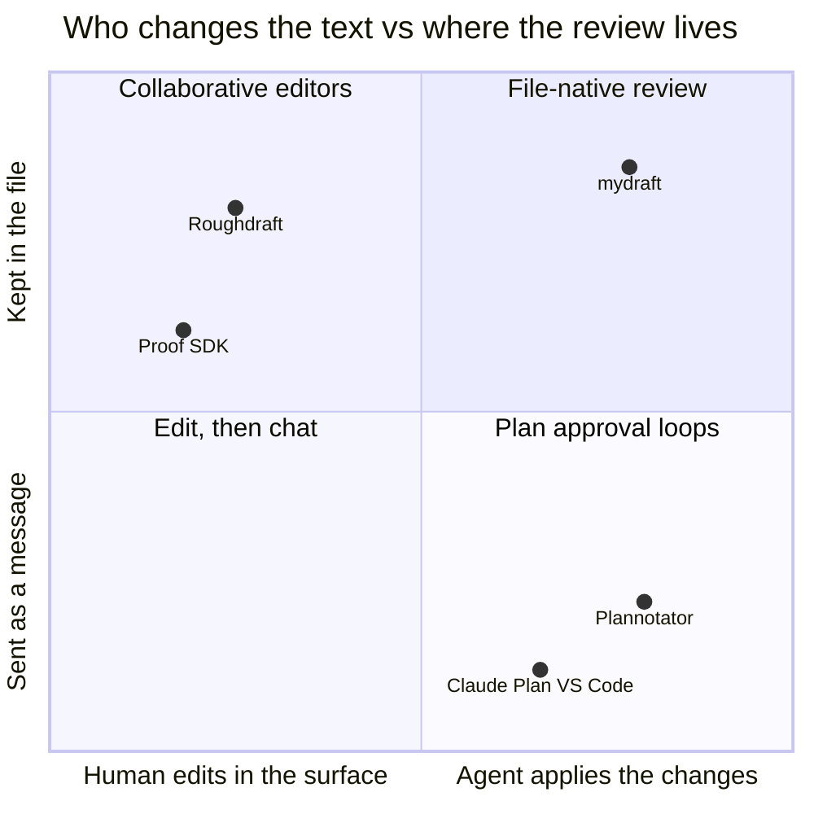

# Annotator, not editor: the case for mydraft {#title}

> [!IMPORTANT]
> **Verdict:** dropping the editor costs less than it looks. In the agent-review loop, the human's job is judgment, not typing. Roughdraft's own users report comments and Done far more than edits. And the editor is the source of most of the bugs that make them distrust it. The cost is real for one group: people who use Roughdraft as their everyday Markdown editor. That group is not mydraft's audience.
>
> **The bigger finding:** mydraft's real competitor in the annotator space is not Roughdraft but [Plannotator](https://github.com/backnotprop/plannotator), with 9.2k stars and daily commits. mydraft's distinct position against both is **durable, file-native review of rich documents**: every comment, reply and resolution lives in the `.md` file, and you can comment on any diagram node, chart mark or block, not just text.

## What the editor actually buys Roughdraft users {#editor-value}

Roughdraft calls itself "a local-first markdown editor and viewer for working with AI". Its TipTap editor gives the reviewer four things mydraft does not:

| Capability | Roughdraft | mydraft today |
|---|---|---|
| Fix a typo or a sentence by typing in place | Yes, saved straight to the file | Propose it as a suggestion (`{~~old~>new~~}`); the agent or you accept it |
| Tracked-changes "suggesting" mode while typing | Yes | Suggestions on a selection, one at a time |
| Write a new section yourself | Yes | In your own editor; the viewer live-reloads on save |
| Formatting toolbar, links, tables | Yes | Not in the viewer |

These matter when the **human is the author**. They matter much less when the agent wrote the document and the human is reviewing it, which is the job both tools are pitched for. Roughdraft's homepage title is "Markdown reviews for coding agents".

## How people actually use Roughdraft {#evidence}

I read all 32 community-era issues (#36 onward) and the public reactions to the launch. No issue asks for more editing power. Several report the editor damaging files:

| Category | Issues | What they show |
|---|---|---|
| Editor rewrites or loses content on save | #96, #98, #99, #100, #104, #125, #36 | Re-serialisation reformats the whole file (`---` → `* * *`, reflowed task lists, collapsed code blocks), drops typed comment text, and fights external edits. Reporters call it "risky to use for canonical Markdown docs". |
| Hand-off breaks before Done | #93, #108, #113, #118, #119, #127, #83 | The 5-minute CLI crash makes the agent act on half-finished reviews. In #83 the agent's rewrite then **overwrote the reviewer's newest comments**: the editor buffer and the agent's file write collided. |
| Install / setup | #79, #80, #81, #109, #111, #116, #137 | Missing `yaml` dependency, pnpm failure, Claude Code refusing to self-modify CLAUDE.md. |
| Reading quality | #82, #94, #114, #115 | Dark-mode contrast, tables, typography, **render Mermaid**. |
| Review workflow | #77, #84, #97, #140, #146, #152 | Open the comment sidebar, embed the reviewer in a side panel, "ask" questions about the doc, a Neovim review plugin, a fork that moves comments into the endmatter so agents parse them more easily. |

The launch reactions describe the same loop. Cathryn Lavery: *"CC/Codex writes, I review in the browser, leave comments, click done. Then the agent responds to my notes."* Jeremy Nguyen framed it as *"Track Changes and Comments"* for Markdown. Nobody praised editing.

> [!NOTE]
> This is evidence about the people who **file issues and post**, a vocal subset. Editor-first users may be happy and quiet. It's a strong signal, not proof.

## {==Where each tool sits==}{>>I like this visual. Can we make it part of the mydraft README, somewhere high up.<<}{#c1} {#landscape}

- **Roughdraft:** the human edits, and the review lives in the file. That combination forces a full re-serialisation on every save, the root of its fidelity bugs.
- **Plannotator:** the agent applies changes, and feedback is a message. It intercepts plan approval (a Claude Code plan-mode hook, Codex's `Stop` hook) and also does code review, HTML annotation and team sharing, across nine agents. Its README says annotations, drafts and history "stay local"; I found no sign that they are written into the Markdown file itself (inference, not verified in its source).
- **mydraft:** the agent applies changes, and the review lives in the file as Roughdraft-compatible CriticMarkup. Threads, replies and resolutions survive into git, into the next round, and into the next agent session.

## Where mydraft is stronger {#strengths}

| | Roughdraft | Plannotator | mydraft |
|---|---|---|---|
| File untouched except where you comment | No: whole-file re-serialisation | Not applicable (reviews a copy/message) | **Yes**: splices at source offsets, rest byte-identical |
| Mermaid, math, charts, highlighted code | No (open PRs #102/#143) | Not verified | **Yes**: Mermaid, KaTeX, Shiki, Vega-Lite, sandboxed HTML, explainer fences |
| Comment on a diagram node / chart mark / block | No, text only | Text and HTML elements | **Yes**: one anchor model for text and objects |
| Review conversation persists in the file | Yes | No: kept in its local history and sent as a message (inferred from README) | **Yes**: threads, replies, resolve, Done notes |
| Agent edit surface | Whole-file writes or `rfm` helpers | Agent rewrites from feedback | **Guarded block/object edits** (`set-block`, `set-object`, version + guard) |
| "What changed since I last looked" | No | Plan diff between versions | **Yes**: revision comparison in the viewer |
| Concurrent agent write during review | Clobbers editor buffer (#83) | Not applicable | Annotations carry a version (`ifVersion`); no human buffer to clobber |
| Long reviews | Crashes at 5 min | Fine: its plan hook waits up to 4 days | 30-min WebSocket wait |
| Ask a question about the doc (#146) | No | **Yes**: "Ask AI" | No: ask in a comment thread |
| Plan-mode interception | No | **Yes** | No |
| Code / PR review | No | **Yes** | No |
| Team sharing | No | **Yes** (URL / encrypted short link) | Remote review behind your own proxy |
| Agents supported | Claude Code, Codex | **Nine** | Claude Code, Codex (`install-prompt`) |
| Community | ~450★, unmaintained since June | **~9.2k★, daily commits** | Just you |

## What mydraft gives up, and the mitigations {#costs}

1. **Can't type a quick fix.** A suggestion does the same job in two more clicks, and the agent applies it with the rest. If this turns out to grate, ADR 0001 already names the cheap fix: a per-block "edit source" textarea that writes one block's source back, still without a WYSIWYG model.
2. **Can't write a section yourself in the surface.** Your own editor (VS Code, Vim, Obsidian) plus mydraft's live reload covers it, and arguably better: you keep your editor's keybindings, spell-check and git integration.
3. **Not an everyday Markdown editor.** True, and intentional. Roughdraft users who wanted that will not switch, and that's fine.

## The pitch {#pitch}

> **mydraft — review what your agent wrote, in the file it wrote.**
> Your agent's plan opens rendered, diagrams and all. Comment on a sentence, a flowchart node or a chart bar; click Done. The agent answers each thread and revises only the blocks you flagged. The conversation stays in the Markdown, so the next round, the next session and `git log` all see it. Your file is never reformatted.

**For:** people whose agents write long-lived documents (design docs, research notes, specs, explainers) that go through several review rounds and live in git. **Next:** people approving an agent's plan before it starts coding, through a plan-mode integration.
**Not for:** code review (use Plannotator or GitHub), or writing prose yourself (use an editor).

## What this means for the successor idea {#successor}

- Roughdraft's **reviewers** are mydraft's audience; its **writers** are not. The format compatibility means their files carry over unchanged.
- Pitch mydraft to them as "Roughdraft's review loop without the editor's damage". That's honest, and it's exactly what their issues ask for.
- Lead with documents that **outlive one approval**, where mydraft has no real competitor. Plan approval is the second front, against Plannotator: it needs a plan-mode hook and a completion signal that never gets lost (see the questions below).

## Fork directions {#forks}

Three agents surveyed the 19 forks that differ meaningfully from upstream; the full report, with commit-level evidence, is [roughdraft-forks-survey.md](roughdraft-forks-survey.md). The short version:

- **Every fork keeps the editor, and most spend their effort fighting it.** Byte-faithful saves, source-preserving merges and Turndown rule fixes were each built independently in at least five forks (moiri-gamboni, kudzuweb, aakashd, joshlivsafe, blake41, and inkback's rewrite to direct Markdown persistence). That is the ecosystem's biggest time sink, and mydraft avoids it by design.
- **Everyone re-fixes the same three blockers.** The yaml dependency, the 5-minute crash (fixed at least ten times across forks and PRs, and the chunked fixes introduced new bugs) and endmatter replies.
- **Only one fork moved toward mydraft's model.** al-ignat added a render-faithfully, annotate-on-an-overlay preview, for HTML files only; it stalled in June. Mermaid appears in four forks and math in one. **No fork annotates diagram nodes or chart marks.** mydraft's rich-rendering niche is uncontested.
- **The ambition is going into the agent protocol.** jjordanguy has the agent edit a markup-free copy and applies its replies and resolutions all at once, wakes the Claude/Codex session on Done, and blocks the agent from hand-editing review markup. kudzuweb reports *why* a review ended (`doneReason`). inkback went MCP-first.
- **The format is fragmenting.** At least six dialects for where comment bodies live (inline vs endmatter, `body:` blocks, fence-line `{#id}` refs, new keys like `reaction`, `scope`, `deleted`). aparajita dropped CriticMarkup entirely for `` anchors plus a versioned endmatter. "Roughdraft-compatible" now has to mean *reads the common dialects*.
- **Nobody publishes to npm.** All installs are from a branch, a packed tarball, or GitHub release tarballs.

| Successor-shaped fork | What it is | Strength | Weakness |
|---|---|---|---|
| **pmbaumgartner/inkback** | Renamed, MIT with attribution, slimmed core, MCP-first, direct Markdown persistence | Most credible intent; versioned releases | 5 days old, pivoting daily (MCP Apps in and out within 24 h), not on npm |
| **kudzuweb/roughdraftplus** | Self-declared "maintained fork"; review-loop contract | Clear `--loop` / `doneReason` semantics | Built by agents in one day, silent since 2026-09-06, CI red |
| **alexandrbasis/roughdraft** | Scoped package, checksummed GitHub releases, update checker | Best distribution story | No successor claim, single maintainer |
| **moiri-gamboni/roughdraft** | Upstream + 175 commits of hardening, history sidecar, dashboard | Deepest engineering | Personal; "install from this branch" |

**Worth borrowing into mydraft**, roughly in order of value:

1. **A {==machine-readable "wh==}{>>what's the value?<<}{#c2}y it ended" field** in `myd view --wait --json`. *Dropped as a standalone item: little value beyond what `myd comments` already shows. A `pending` count may ride along with the completion-signal fix.*
2. **R{==ead the other dialects==}{>>no need for now<<}{#c3}** (endmatter `body:` blocks, compact `{#c1}` refs, `reaction`), keep unknown keys, and give a clear error on aparajita's 1.0 format. *Deferred.*
3. **Ve{==rsion ch==}{>>agreed<<}{#c4}ecks on `myd reply` / `myd resolve`** like inkback's `expectedVersion`, and **id counters** in the endmatter so a cleared id is never reused. *Agreed.*
4. **{==Snapshot before every agent writ==}{>>what problem does it solve? why agent hook instead of myd built-in behavior?<<}{#c5}e**, built into the myd server rather than a hook. The server already watches every reviewed file, but keeps only the reader-facing text of the previous version. Keeping the full previous source, comments and endmatter included, would make any write by any tool undoable with a `myd restore`. *Proposed.*
5. **{==An explicit authorization rule in the myd skill:==}{>>leave it out for now<<}{#c6}** "Done does not authorize accepting every suggestion or starting implementation" (inkback). *Left out for now.*
6. **{==A footer navigator==}{>>makes sense<<}{#c7}** for crowded documents: count, previous/next, current thread (aparajita). *Agreed.*

## {==Questions for you==}{>>one thing we dont have working reliably is agent get triggered/notified on review completion action<<}{#c10} {#questions}

1. {==Is the audience "multi-round, file-native review of rich documents" the one you want, or do you want to compete for quick plan approval too?==}{>>both<<}{#c8}
2. {==Should the per-block "edit source" escape hatch move up the roadmap to answer "but I can't type"?==}{>>not yet<<}{#c9}
3. Is Plannotator interoperability worth exploring (e.g. a `myd` command that turns Plannotator feedback into in-file threads), or ignore it?
4. **Reliable completion signal** (from your comment on this heading): should I start on step 1 now, a `myd wait` that can never end silently? See the thread for the two-step plan.

---
comments:
  c1:
    by: user
    at: 2026-10-07T22:52:13.543Z
    status: resolved
    resolvedBy: AI
    resolvedAt: 2026-10-07T23:00:13.932Z
  c2:
    by: user
    at: 2026-10-07T22:54:41.639Z
    status: resolved
    resolvedBy: AI
    resolvedAt: 2026-10-07T23:00:14.130Z
  c3:
    by: user
    at: 2026-10-07T22:54:50.048Z
    status: resolved
    resolvedBy: AI
    resolvedAt: 2026-10-07T23:00:14.309Z
  c4:
    by: user
    at: 2026-10-07T22:54:58.519Z
    status: resolved
    resolvedBy: AI
    resolvedAt: 2026-10-07T23:00:14.482Z
  c5:
    by: user
    at: 2026-10-07T22:55:29.367Z
    status: resolved
    resolvedBy: AI
    resolvedAt: 2026-10-07T23:00:14.647Z
  c6:
    by: user
    at: 2026-10-07T22:55:59.439Z
    status: resolved
    resolvedBy: AI
    resolvedAt: 2026-10-07T23:00:14.850Z
  c7:
    by: user
    at: 2026-10-07T22:56:09.854Z
    status: resolved
    resolvedBy: AI
    resolvedAt: 2026-10-07T23:00:15.048Z
  c8:
    by: user
    at: 2026-10-07T22:56:26.519Z
    status: resolved
    resolvedBy: AI
    resolvedAt: 2026-10-07T23:00:15.242Z
  c9:
    by: user
    at: 2026-10-07T22:56:37.151Z
    status: resolved
    resolvedBy: AI
    resolvedAt: 2026-10-07T23:00:15.420Z
  c10:
    by: user
    at: 2026-10-07T22:57:23.397Z
  c11:
    body: "Done: the quadrant is in the README right after the intro paragraphs, with two sentences explaining the axes and a link back here."
    by: AI
    at: 2026-10-07T22:59:42.459Z
    re: c1
  c12:
    body: Honestly, small. Today the Done event already carries your note, and the skill makes the agent run `myd comments` next, which lists what's pending. A dedicated field would save that one call and give a mechanical stop rule (empty note + 0 pending = finished). kudzuweb's version guesses approval by matching phrases like 'lgtm', which is brittle. I've dropped it as a standalone item; at most a `pending` count rides along with the completion-notification fix you raised in c10.
    by: AI
    at: 2026-10-07T22:59:42.623Z
    re: c2
  c13:
    body: Deferred in the list.
    by: AI
    at: 2026-10-07T22:59:42.803Z
    re: c3
  c14:
    body: "Marked agreed. Both are small: an optional --version on reply/resolve (the same guard set-block uses), and a counter in the endmatter so ids are never reused after a thread is cleared."
    by: AI
    at: 2026-10-07T22:59:42.991Z
    re: c4
  c15:
    body: "The problem: an agent that rewrites the file with its own Edit/Write tools, bypassing myd, can wipe your comments or text. That's Roughdraft #83, where the agent's rewrite overwrote the reviewer's newest comments. You're right that it belongs in myd, not a hook. The server already watches every reviewed file and its revision tracker keeps the previous version, but only the reader-facing text, without comments or endmatter. Keeping the full previous source would make any write by any tool undoable (a `myd restore`). A PreToolUse hook would only add prevention, blocking the agent's raw edit before it happens; we don't need that yet. Rewrote the item that way."
    by: AI
    at: 2026-10-07T22:59:43.171Z
    re: c5
  c16:
    body: Marked left out.
    by: AI
    at: 2026-10-07T22:59:43.340Z
    re: c6
  c17:
    body: Marked agreed.
    by: AI
    at: 2026-10-07T22:59:43.508Z
    re: c7
  c18:
    body: "Updated the pitch and successor sections. Competing for plan approval too means one new piece: a plan-mode integration (Claude Code's plan-approval hook, Codex's Stop hook) that opens the plan in myd and returns approve or feedback. That's how Plannotator does it, and its hook waits up to 4 days. It depends on the same reliable completion signal as c10."
    by: AI
    at: 2026-10-07T22:59:43.673Z
    re: c8
  c19:
    body: "Noted: stays where it is."
    by: AI
    at: 2026-10-07T22:59:43.837Z
    re: c9
  c20:
    body: "Agreed, and it happened during this very review. My `myd view --wait` exited silently with code 0 more than 10 minutes in, while you were still commenting. I only had your first five comments when it died. I re-attached with `myd wait` and caught your Done. Proposed fix, in two steps: (1) make the wait impossible to lose. It must never exit without printing a result; on a dropped socket it reconnects, and it falls back to checking the server's done log. A test of this is running now. (2) For plan approval (c8) and asynchronous use, a wake path that doesn't depend on the agent holding a blocking call: a Claude Code/Codex hook, or jjordanguy's approach of injecting a message into the agent session. Should I start on (1) now? It's a contained fix in src/cli.ts."
    by: AI
    at: 2026-10-07T22:59:44.011Z
    re: c10
  c21:
    body: Well yeah, but I don't know how you make the weight impossible to uh lose because it maybe depends on um you know what Cloud Code or Codex supports. Uh injecting a message into the agent session sounds like generically speaking a good idea. Um I think in particular the idea of monitors or like watching file changes, that is maybe the most powerful one because I think those things might might have a much longer expiration time. So look into that.
    by: user
    at: 2026-10-07T23:02:08.963Z
    re: c10
  c22:
    body: So I didn't actually reread the new version of this doc because I don't know what changed and I don't want to reread all of it. So I only left out one comment as a reply to your comment. Uh so you decide basically what's our next step here.
    by: user
    at: 2026-10-07T23:03:26.088Z
  c23:
    body: "You're right that 'impossible to lose' isn't fully ours to promise. Two separate problems: (a) myd must never exit without saying why. That part is ours: the silent exit I hit is a bug to root-cause. (b) How the agent learns about Done. For Claude Code there is already a mechanism that matches your watch idea and doesn't expire: a background command. The agent starts `myd wait FILE` in the background and ends its turn; Claude Code re-invokes it with the output when the command exits. That's how I was notified when my first wait ended. The Monitor tool (streams events) is capped at 30 to 60 minutes per arm, so for a single Done the background wait fits better: no polling and no blocked turn. For Codex I don't know an equivalent yet; jjordanguy's fork injects a message with `codex queue --thread`, which needs checking. Also, on your Done note: the ± Changes button only compares the last two revisions, and I made four separate edits, so it couldn't show you everything since your last Done. That's a real gap: compare against the version you last finished, and have the agent list its changes when it hands back. I'll take these as the next steps; details in chat."
    by: AI
    at: 2026-10-07T23:04:11.525Z
    re: c10
  c24:
    body: "Scope update: the Codex / ChatGPT desktop wake path is TBD and out of scope for now. The completion-signal work covers Claude Code only (background `myd wait` that wakes the agent on Done). Other agents keep the current handoff: open the review, end the turn, and the user says done in chat."
    by: AI
    at: 2026-10-10T03:22:13.572Z
    re: c10
  c25:
    body: "Built (Claude Code): the agent runs `myd view FILE --wait --timeout 0` as a background command and ends its turn; Done exits it and wakes the agent. The wait reconnects after a server restart, catches a Done that lands while disconnected, and prints why it exited on every path. The earlier 'silent exit' was a false alarm from my own monitoring command. ± Changes now compares against the revision you last clicked Done on."
    by: AI
    at: 2026-10-10T03:38:04.268Z
    re: c10
