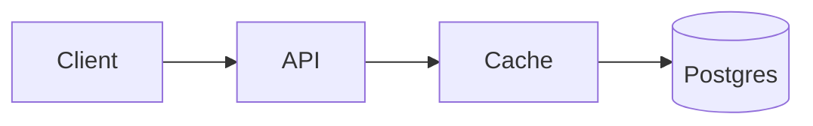

# Request pipeline

The service handles reads through a small pipeline.

```mermaid {#flow}
graph LR
  Client --> API
  API --> Cache
  Cache --> DB[(Postgres)]
```

## Notes

Latency budget is 50 ms end to end.
