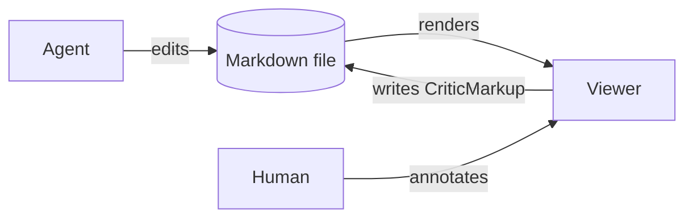

# my{~~d demo: rich blocks + annotations~>d demo: rich blocks + annotations bleu blue blue, test~~}{#s2}

Thi{==s paragra==}{>>test<<}{#c11}ph h{==a==}{>>if my selection crosses in the next word which is bolded, the dialogue appears, but it wont let me save. find the bug.<<}{#c13}s **{==bold text==}{>>why bold?<<}{#c1}**, `inline code`, a [link](https://example.com), and inline math $\alpha + \beta = \gamma$.

## Diagram


{>>should Viewer also write back?<<}{#c5}


## Math

$$\int_0^1 x^2\,dx = \tfrac{1}{3}$$

## Chart {#chart-section}

```vega-lite
{"$schema":"https://vega.github.io/schema/vega-lite/v5.json","width":360,"height":180,
 "data":{"values":[{"x":"a","y":28},{"x":"b","y":55},{"x":"c","y":43},{"x":"d","y":91}]},
 "mark":"bar","encoding":{"x":{"field":"x","type":"nominal"},"y":{"field":"y","type":"quantitative"}}}
```
{>>Code doesnt look well on dark theme.Also i want a small window on the selected text when annotation not a dialogue window.<<}{#c6}


## Code

```ts
export function hello(name: string): string {
  return `hi ${name}`;
}
```

> [!NOTE]
> {~~Callouts render with a title.~>Callouts render with a bold title.~~}{#s1}

## HTML island

```html
<div style="font-family:system-ui;padding:12px;border-radius:8px;background:linear-gradient(90deg,#4f46e5,#06b6d4);color:#fff">
  <b>Sandboxed island</b> — arbitrary HTML/JS runs here, isolated. <button onclick="this.textContent='clicked ' + (++window.n||(window.n=1))">click me</button>
</div>
```

| col a | col b |
|---|---|
| 1 | 2 |
| 3 | 4 |

---
comments:
  c1:
    by: user
    at: 2026-08-16T02:19:01.117Z
    status: resolved
    resolvedBy: AI
    resolvedAt: 2026-08-16T02:19:01.763Z
    resolution: explained
  c2:
    body: tiny wording fix
    by: user
    at: 2026-08-16T02:19:01.161Z
    re: s1
  c4:
    body: Bold marks the term being defined.
    by: AI
    at: 2026-08-16T02:19:01.630Z
    re: c1
  c5:
    by: user
    at: 2026-08-16T02:20:21.928Z
    anchor:
      block: b3
      target: node:Viewer
    status: resolved
    resolvedBy: AI
    resolvedAt: 2026-08-16T04:04:39.378Z
  c6:
    by: user
    at: 2026-08-16T04:00:09.203Z
    anchor:
      block: b7
    status: resolved
    resolvedBy: AI
    resolvedAt: 2026-08-16T04:04:39.051Z
    resolution: dark code + inline editor shipped
  c7:
    body: test
    by: user
    at: 2026-08-16T04:00:34.470Z
    re: c5
  c8:
    body: "Fixed both: Shiki dual-theme CSS was wired wrong (dark code now uses
      --shiki-dark + dark bg); the modal dialog is replaced by a small inline
      editor anchored under the selection (Ctrl+Enter saves, Esc cancels). Same
      inline editor for diagram-node/block comments."
    by: AI
    at: 2026-08-16T04:04:38.884Z
    re: c6
  c9:
    body: Yes — that edge exists (V → F 'writes CriticMarkup'); the arrow just
      overlaps visually. Leaving as is.
    by: AI
    at: 2026-08-16T04:04:39.220Z
    re: c5
  c10:
    body: want dark/lgith mode toggle
    by: user
    at: 2026-08-16T04:15:47.097Z
    status: resolved
    resolvedBy: AI
    resolvedAt: 2026-08-16T04:16:05.968Z
  c11:
    by: user
    at: 2026-08-16T04:15:52.895Z
  c12:
    body: Added ◐ toggle in the top bar (persists in localStorage; re-renders
      Mermaid/Vega with the matching theme).
    by: AI
    at: 2026-08-16T04:16:05.783Z
    re: c10
  c13:
    by: user
    at: 2026-08-16T04:16:33.920Z
  c14:
    body: go on
    by: user
    at: 2026-08-16T04:16:51.274Z
suggestions:
  s1:
    by: user
    at: 2026-08-16T02:19:01.161Z
  s2:
    by: user
    at: 2026-08-16T04:14:57.974Z
