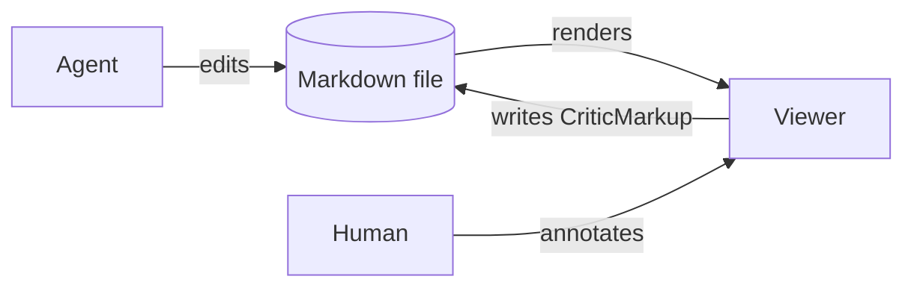

# myd demo: rich blocks + annotations

This paragraph has **{==bold text==}{>>why bold?<<}{#c1}**, `inline code`, a [link](https://example.com), and inline math $\alpha + \beta = \gamma$.

## Diagram


{>>should Viewer also write back?<<}{#c5}


## Math

$$\int_0^1 x^2\,dx = \tfrac{1}{3}$$

## Chart

```vega-lite
{"$schema":"https://vega.github.io/schema/vega-lite/v5.json","width":360,"height":180,
 "data":{"values":[{"x":"a","y":28},{"x":"b","y":55},{"x":"c","y":43},{"x":"d","y":91}]},
 "mark":"bar","encoding":{"x":{"field":"x","type":"nominal"},"y":{"field":"y","type":"quantitative"}}}
```

## Code

```ts
export function hello(name: string): string {
  return `hi ${name}`;
}
```

> [!NOTE]
> {~~Callouts render with a title.~>Callouts render with a bold title.~~}{#s1}

## HTML island

```html
<div style="font-family:system-ui;padding:12px;border-radius:8px;background:linear-gradient(90deg,#4f46e5,#06b6d4);color:#fff">
  <b>Sandboxed island</b> — arbitrary HTML/JS runs here, isolated. <button onclick="this.textContent='clicked ' + (++window.n||(window.n=1))">click me</button>
</div>
```

| col a | col b |
|---|---|
| 1 | 2 |
| 3 | 4 |

---
comments:
  c1:
    by: user
    at: 2026-08-16T02:19:01.117Z
    status: resolved
    resolvedBy: AI
    resolvedAt: 2026-08-16T02:19:01.763Z
    resolution: explained
  c2:
    body: tiny wording fix
    by: user
    at: 2026-08-16T02:19:01.161Z
    re: s1
  c4:
    body: Bold marks the term being defined.
    by: AI
    at: 2026-08-16T02:19:01.630Z
    re: c1
  c5:
    by: user
    at: 2026-08-16T02:20:21.928Z
    anchor:
      block: b3
      target: node:Viewer
suggestions:
  s1:
    by: user
    at: 2026-08-16T02:19:01.161Z
