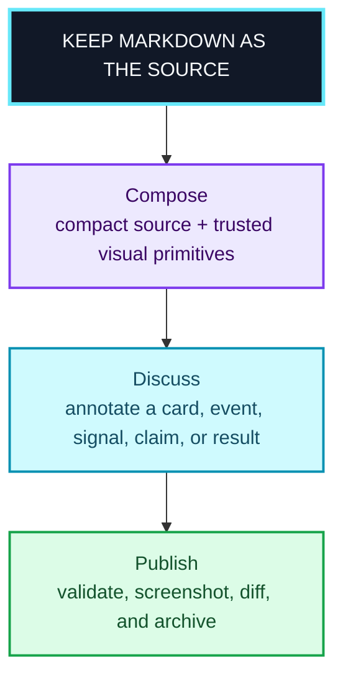
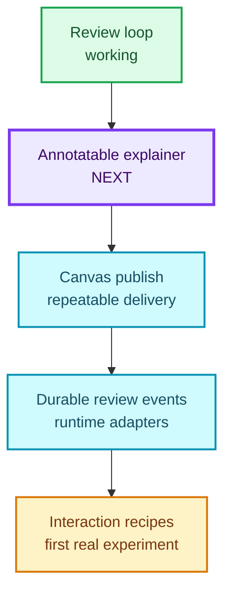
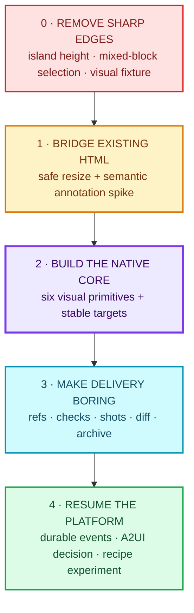
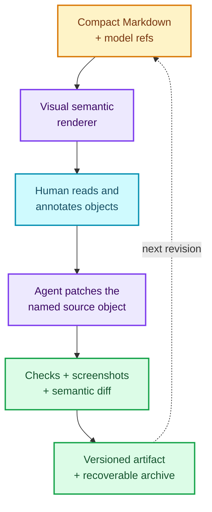

# The next myd bet: annotatable visual explainers {#title}

> [!NOTE]
> **Historical planning record.** This document preserves the original proposal and its review threads. The concise, current source of truth is [the mydraft roadmap](roadmap.md).


{>>yeah, how to do diff well is a big question.<<}{#c12}

{>>can markdown really be sufficient? the visual explainer skill uses much richer html<<}{#c11}

{>>this ended up getting "folded". it has a scroll at the right instead of being rendered fully. i think fully is the right move here.<<}{#c1}


> [!IMPORTANT]
> The first draft used a custom HTML hero. It looked richer but collapsed into a 120px scrolling iframe and could only be annotated as one opaque block. This replacement expands fully and exposes each Mermaid node as a target. It is deliberately only a bridge: a diagram vocabulary is not yet the flexible visual-explainer vocabulary we need.

## Recommendation {#recommendation}

Build an **annotatable explainer vertical slice** next. It should add a compact, declarative `explainer` fence rendered by myd into trusted native components, with stable target IDs and source-preserving edits. Follow it immediately with a thin `myd publish` orchestrator built from the primitives that already exist.

{==Do **not** make full A2UI, draft branches, or the Interaction Skill Garden the next milestone.==}{>>agreed, although i've forgotten what draft branch means here<<}{#c13} Preserve those directions, but first prove the missing product experience: a {==visual explanation that is delightful to read, precise to annotate, compact for an agent to revise, and faithful when exported.==}{>>yes!<<}{#c14}



## What is real today {#stocktake}

### A compact, credible core

- One-way Markdown rendering preserves source fidelity and supports GFM, KaTeX, Shiki, callouts, Mermaid, Vega/Vega-Lite, images, and sandboxed HTML.
- Text spans, rich blocks, Mermaid nodes, and Vega marks are annotatable. Comments, suggestions, replies, and resolutions round-trip through Roughdraft-compatible {==CriticMarkup==}{>>what is CriticMarkup?<<}{#c15}.
- Named block IDs, block reads/replacements/inserts, optimistic version checks, live reload, revision labels, review lifecycle tracking, theme switching, standalone HTML export, screenshots, and source diffs all exist in some form.
- The unit suite is green: **18 tests pass**. The latest agent-workflow baseline is also green across **5 journeys × 2 agents**, including plan handoff, diagram explanation, uncertain-claim handling, suggestion application, and Mermaid object comments.

### The roadmap is ahead of the implementation

| Planned capability | State in this repository |
|---|---|
| Visual Markdown review loop | Working and evaluated |
| Versioning | Revision numbers and hashes exist; content snapshots, restore, and draft branches do not |
| Durable events | `done.log` and synchronous waiting exist; the portable cursor/replay contract and runtime adapters remain a plan |
| Agent block API | CLI read/replace/insert with version check exists; no MCP surface, component patching, delete/move, or semantic diff |
| Standalone publishing | Export and screenshot primitives exist; no archive/index/check orchestration |
| Declarative UI | Mermaid and Vega are typed; HTML is opaque; no A2UI or trusted explainer component catalog |
| Interaction Skill Garden | ADR and research are substantial; there is not yet a recipe renderer, registry, telemetry, or evidence loop |

The other agent's `wip.md → wip.html` pattern is directionally right, but those files and model-result inputs are not present in this repository, so their exact workflow cannot yet be validated here.

## Why this comes before `myd publish` {#why-now}

The proposed publish command removes operational friction. The explainer layer removes the product's central reading and collaboration friction. Automating today's presentation would give us a faster pipeline to an experience you already find visually uniform.

The explainer slice also creates the first concrete substrate for the Interaction Skill Garden: a versioned vocabulary of visual objects with IDs, state, events, and observable use. Without that vocabulary, “interaction recipes” remain an architectural essay rather than something we can trial.

## The missing middle: an explainer fence {#explainer-fence}

Treat the schema as a hypothesis, not a proven optimization. A small YAML or JSON structure could improve agent ergonomics because named semantic objects are patchable, mechanically validatable, and reusable without regenerating CSS and layout boilerplate. It could save tokens only when those avoided generations and smaller revisions outweigh the cost of loading the schema and catalog instructions. For a one-off or simple document, plain Markdown may remain cheaper. Keep the schema renderer-neutral to preserve the source contract, but earn adoption with measurement rather than architectural taste.==}{>>what's the evidence or rationale for why this would lead to tokens saved? or better agent experience/ergonomics?

think critically.<<}{#c3}

````yaml
```explainer {#decision-epoch}
theme: aurora
sections:
  - type: timing
    id: local-recognition
    parties: [Alice, Bob]
    events:
      - id: alice-trigger
        party: Alice
        observes: detector-A fires
        action: close local epoch
        locality: local
        synchronization: measured
      - id: bob-trigger
        party: Bob
        observes: detector-B fires
        action: close local epoch
        locality: local
        synchronization: measured
  - type: measurement-grid
    id: evidence
    rows:
      - signal: local detector event
        action: advance local state
        owner: each party
  - type: result-panel
    id: ld-result
    label: LD
    value: {$ref: results.json#/ld/value}
    status: measured
```
````

Every authored `id` becomes an annotation target such as `decision-epoch›alice-trigger` or `decision-epoch›ld-result`. The source remains compact; the rendered result can use color, hierarchy, whitespace, icons, and responsive layout without hand-written CSS in each document.

> [!NOTE]
> **Token claim to test:** compare plain Markdown, one-off visual HTML, a first-use explainer fence, and a reused explainer recipe across initial authoring plus three revisions. Record total input/output tokens, serialized source size, changed semantic objects, invalid generations, and time to an accepted revision. The explainer format wins only if it reaches a break-even point in realistic reuse; readability alone is a separate outcome.

## First component catalog {#catalog}

Keep v0 deliberately small and research-shaped:

| Primitive | Reading job | Annotation target |
|---|---|---|
| `hero` / `section-lede` | Establish hierarchy and visual rhythm | Whole section or emphasized claim |
| `measurement-card` | Surface a value, unit, provenance, and status | Card, value, or provenance link |
| `two-party-timing` | Explain locally observed events without an implicit referee | Party lane, event, signal, transition |
| `signal-action-grid` | Map evidence to ownership and permitted action | Row or cell |
| `result-panel` | Present LD/Q/NS results consistently | Panel, metric, caveat |
| `claim` / `evidence` | Distinguish measured, derived, assumed, and speculative statements | Claim and its supporting source |

These components address today's real documents. Generic cards, forms, dashboards, and a full A2UI stock catalog can wait until a real use case demands interaction state beyond review annotations.

## Make the timing issue a schema gate {#timing-gate}

The first acceptance document should be the two-party decision-epoch explainer. The component validator should require each transition to declare:

- **who** owns the transition;
- **what locally available signal** they observe;
- **what state change or action** follows; and
- whether any synchronization assumption is measured, communicated, derived, or merely assumed.

A timing diagram that depends on a global “round ended” event with no owner or locally available signal should fail validation. This turns the referee ambiguity into a reusable correctness check instead of a prose reminder.

## Then wrap it in `myd publish` {#publish}

Once on{==e real explainer can be ==}{>>selecting the code below, or this line, the code below, and the non-code line below neither triggered a Comment/Suggest selection<<}{#c2}authored and annotated, compose the existing tools into:

```bash
myd publish code/research/explainers/wip.md --profile research
```

The command should:

1. Resolve `$ref` values from declared JSON/model artifacts and record their hashes.
2. Validate schema, IDs, required provenance, local links, and claim/result consistency. “Claim checking” should mean traceability and exact-value consistency—not pretending to prove scientific truth.
3. Render compact standalone HTML in light and dark themes; run accessibility/contrast and responsive-layout checks at phone and desktop widths.
4. Produce deterministic screenshots and a semantic **source** diff by Markdown/explainer block. Do not review generated HTML diffs.
5. Archive the prior source, artifact, manifest, and screenshots atomically, then update a generated archive index.

The publish manifest is the durable release record; HTML remains disposable.

## Delivery slices and gates {#delivery}



### Slice 0 — housekeeping (less than a day)

- Fix the package typecheck script (`bunx` is not available here; `npx tsc --noEmit` succeeds).
- Fix sandboxed-island sizing through an explicit height-message protocol; the current parent-side `contentDocument` read cannot work safely with this sandbox.
- Specify cross-block selection behavior. At minimum, explain why prose → code → prose ranges cannot be annotated; preferably anchor them as a multi-block quote.
- Add a visual regression fixture and verify screenshots outside this restricted sandbox.

### Slice 1 — {==annotation bridge s==}{>>slices 0-3 look so uniform. just white text on grey background. a little highlighting via bold. still very hard to read. seems color and some gentle visual breaks may help. or maybe it's just too much content. not sure.<<}{#c4}pike (1–2 days)

Spike a narrow `postMessage` bridge for sandboxed HTML: intrinsic height, semantic element clicks, and selected text flow out; comments flow into the normal myd anchor model. This is compatibility for existing visual explainers, not the long-term source format.

**Gate:** one island renders at its full height and independently round-trips comments on two identified cards. Stop if safe selection and identity require a broad iframe capability surface.

### Slice 2 — native explainer v0 (about one week)

- Parse and validate the six-component `explainer` fence.
- Render semantic children in the main DOM with stable annotation targets and component patch ops.
- Establish purposeful type, accent, density, theme, and mobile tokens; preserve standalone-export parity.

**Gate:** the timing explainer is readable without its source, and a reader can separately comment on a timing event, grid cell, measurement, and result.

### Slice 3 — publish v0 (several days)

- Resolve model refs; write a release manifest; check schema, traceability, links, contrast, and responsive layout.
- Produce dual-theme/mobile screenshots, a semantic source diff, an atomic archive, and the generated index.

**Gate:** changing a model result updates the exact visual object, names it in the source diff, and leaves the prior release recoverable.

### Slice 4 — resume the platform roadmap

- Finish durable event cursor/replay semantics and thin runtime adapters.
- Decide whether A2UI adds enough interoperability for interactive/stateful blocks to justify adopting it.
- Run the first Interaction Skill Garden experiment on explainer recipes, comparing plain Markdown, one-off HTML, fixed explainer primitives, and a reused recipe.

## What success looks like {#success}

The milestone is not “more color.” It is this loop:


{>>this is too wide and is rendered too small for me to read the text. need a layout that does not result in unreadable small text.<<}{#c5}


If that loop feels dramatically better on one serious research explainer, build the publish ergonomics and then generalize. If it does not, we have learned cheaply before committing to A2UI, a component marketplace, or an evidence-driven recipe registry.


---
comments:
  c1:
    by: user
    at: 2026-08-16T07:08:07.185Z
    anchor:
      block: north-star
    status: resolved
    resolvedBy: AI
    resolvedAt: 2026-08-16T07:15:58.904Z
    resolution: Addressed in the revised roadmap.
  c2:
    by: user
    at: 2026-08-16T07:09:31.519Z
    status: resolved
    resolvedBy: AI
    resolvedAt: 2026-08-16T07:15:59.730Z
    resolution: Addressed in the revised roadmap.
  c3:
    by: user
    at: 2026-08-16T07:11:01.704Z
    status: resolved
    resolvedBy: AI
    resolvedAt: 2026-08-16T07:16:00.517Z
    resolution: Addressed in the revised roadmap.
  c4:
    by: user
    at: 2026-08-16T07:12:34.958Z
    status: resolved
    resolvedBy: AI
    resolvedAt: 2026-08-16T07:16:01.259Z
    resolution: Addressed in the revised roadmap.
  c5:
    by: user
    at: 2026-08-16T07:13:10.443Z
    anchor:
      block: success-loop
    status: resolved
    resolvedBy: AI
    resolvedAt: 2026-08-16T07:16:02.002Z
    resolution: Addressed in the revised roadmap.
  c6:
    body: Agreed. This is a real iframe sizing bug, not a desirable fold. A sandbox without same-origin access prevents the current parent-side height read, so it silently stays at 120px. I replaced this hero with a native vertical Mermaid block so it expands fully, and added an explicit height-message protocol to Slice 0.
    by: AI
    at: 2026-08-16T07:15:58.560Z
    re: c1
  c7:
    body: "Confirmed from the implementation: selection capture requires one common data-pos block. A prose-to-code-to-prose range has no such block, so the popover is skipped. I added this to Slice 0 as a product decision and fix target: support a multi-block quote anchor if feasible, otherwise explain the boundary in the UI."
    by: AI
    at: 2026-08-16T07:15:59.292Z
    re: c2
  c8:
    body: "There is no evidence yet that the schema saves tokens, and the earlier wording leaned too hard on architecture. I rewrote it as a hypothesis: reuse and targeted patches may avoid repeated CSS and layout generation, while schema and catalog loading add cost. I also added a four-condition benchmark with an explicit break-even criterion."
    by: AI
    at: 2026-08-16T07:16:00.129Z
    re: c3
  c9:
    body: "Agreed. I shortened the slice copy and added a vertical, color-coded delivery map before the details. This is also evidence for the core recommendation: current Markdown and callout styling does not provide enough hierarchy even when the content is structured."
    by: AI
    at: 2026-08-16T07:16:00.908Z
    re: c4
  c10:
    body: Fixed. The success loop is now vertical, so the SVG keeps readable label sizes instead of shrinking a six-node horizontal row to fit the document width.
    by: AI
    at: 2026-08-16T07:16:01.634Z
    re: c5
  c11:
    by: user
    at: 2026-08-16T16:03:05.019Z
    anchor:
      block: north-star
      target: mm17868646732070-flowchart-N-0
    status: resolved
    resolvedBy: AI
    resolvedAt: 2026-08-17T21:04:11.099Z
    resolution: Clarified Markdown as source container, with native explainers and HTML as complementary rendering layers.
  c12:
    by: user
    at: 2026-08-16T16:03:33.203Z
    anchor:
      block: north-star
      target: mm17868961852430-flowchart-P-5
    status: resolved
    resolvedBy: AI
    resolvedAt: 2026-08-17T21:04:11.501Z
    resolution: Recorded the implemented semantic-diff foundation and deferred broader presentation until validated.
  c13:
    by: user
    at: 2026-08-16T16:04:18.607Z
    status: resolved
    resolvedBy: AI
    resolvedAt: 2026-08-17T21:04:11.896Z
    resolution: Explained draft branches and removed them from the active roadmap.
  c14:
    by: user
    at: 2026-08-16T16:04:33.655Z
    status: resolved
    resolvedBy: AI
    resolvedAt: 2026-08-17T21:04:12.299Z
    resolution: Captured as the accepted north star.
  c15:
    by: user
    at: 2026-08-16T16:04:56.472Z
    status: resolved
    resolvedBy: AI
    resolvedAt: 2026-08-17T21:04:12.698Z
    resolution: Explained CriticMarkup in plain language; the canonical roadmap avoids relying on the term.
  c16:
    body: Markdown is sufficient as the source container, not as the visual styling language. Native explainer fences provide trusted rich rendering for reusable semantic objects, while sandboxed HTML remains the escape hatch for genuinely custom visuals. The roadmap will state that boundary explicitly.
    by: AI
    at: 2026-08-17T21:04:10.897Z
    re: c11
  c17:
    body: The useful diff is semantic source diff, not generated-HTML diff. We now have a small implementation that names changed scalar fields by stable explainer object ID; integrating it into a readable review/publish experience remains later work and should grow only from real review needs.
    by: AI
    at: 2026-08-17T21:04:11.300Z
    re: c12
  c18:
    body: A draft branch meant a separately saved alternative version of a document that could later be selected or merged. We have not validated a need for that workflow, so it is not part of the active roadmap.
    by: AI
    at: 2026-08-17T21:04:11.700Z
    re: c13
  c19:
    body: This became the accepted product test in ADR 0003 and remains the roadmap's north star.
    by: AI
    at: 2026-08-17T21:04:12.101Z
    re: c14
  c20:
    body: CriticMarkup is the compact annotation syntax stored alongside Markdown—for example, highlighted text plus a comment marker. myd renders it as comments and suggestions, so readers normally interact with the review UI rather than the raw syntax.
    by: AI
    at: 2026-08-17T21:04:12.500Z
    re: c15
