# Issue 16 — change-focused review revisions {#title}

**Status:** approved; reviewer-experience slice implemented  
**Issue:** [#16 — bounded review packet and transactional clean-revision apply](https://github.com/Zburatorul/mydraft/issues/16)

> [!IMPORTANT]
> The product outcome is not “show a prettier diff.” It is: **after an agent acts on a review, the reviewer can quickly understand what changed, why it changed, what did not change, and what still needs attention.** The packet and transaction are the machinery that makes those claims trustworthy.

## Decision {#decision}

Build a **clean revision handoff** from one completed review to a new review:

1. the completed review is frozen as readable history;
2. the agent reads one bounded packet from that snapshot;
3. all edits and item dispositions are validated against one version and committed once;
4. the resulting review is linked to its predecessor; and
5. the new review opens in a rendered, change-focused mode by default.

The primary experience stays inside the rendered document. Changed regions retain their real typography and rich rendering. Unchanged runs recede or collapse. A change rail connects each region to the comment that motivated it and to the agent's disposition. The existing line-oriented source diff remains available as an audit detail, not the main review surface.

This is one review-to-revision link, not a general revision browser, branching history, rollback system, or provenance platform.

## The reviewer’s actual job {#reviewer-job}

A returning reviewer is not trying to answer “which source lines differ?” They are trying to answer these questions, in this order:

1. **Did the agent address my feedback?**
2. **Where did the document change?**
3. **Did anything change that was not connected to my feedback?**
4. **Can I recover the original context and thread without hunting?**
5. **Can I trust that neighboring material stayed stable?**
6. **What remains unresolved?**

That ordering matters. A raw unified diff answers question 2 incompletely and leaves the reviewer to reconstruct every other answer.

### Experience contract

The feature succeeds when a reviewer can:

- scan the complete change set without rereading the whole document;
- move from a prior comment to its disposition and changed region in one action;
- move from a changed region back to the motivating thread in one action;
- distinguish additions, modifications, removals, and “no source change” outcomes without relying on color alone;
- see unconnected changes explicitly labeled rather than silently mixed in;
- expand unchanged material when context is needed;
- review rich objects in their rendered form, with exact object-level emphasis when stable identity permits it; and
- switch to the ordinary full document without losing scroll position or review progress.

## Why the current comparison is not enough {#current-gap}

The newly added **± Changes** dialog is a useful diagnostic, but it compares only the two latest observed file versions and renders line-oriented source hunks in a modal. That creates four UX failures:

| Current behavior | Cost to the reviewer |
|---|---|
| Latest revision versus immediately previous revision | The baseline may be a watcher event or annotation write, not the review the human completed. |
| Markdown source lines | The reviewer must mentally reconstruct prose, tables, diagrams, and explainers. |
| Modal separated from the document and comments | The reviewer repeatedly loses reading context while answering “why did this change?” |
| No recorded attribution | The UI cannot honestly claim that a hunk addressed a particular comment. |

The existing dialog should survive as **View source diff**. It is valuable for exact auditing and as a fallback when semantic matching cannot explain a change.

## Proposed reviewer journey {#journey}

```mermaid {#review-journey}
flowchart LR
  H[Human completes review R7] --> S[Freeze R7 snapshot]
  S --> P[Agent reads bounded packet at version V]
  P --> A[Apply edits + dispositions atomically]
  A --> N[Open linked review R8]
  N --> C[Changes mode opens by default]
  C --> J[Jump through rendered changes]
  J --> T[Open prior thread when needed]
  T --> D[Done Reviewing]

  classDef human fill:#ede9fe,stroke:#7c3aed,color:#3b0764,stroke-width:2px;
  classDef agent fill:#cffafe,stroke:#0891b2,color:#164e63,stroke-width:2px;
  classDef review fill:#dcfce7,stroke:#16a34a,color:#14532d,stroke-width:2px;
  class H,J,T,D human;
  class P,A agent;
  class S,N,C review;
```



### First frame

The reviewer lands on the new rendered revision with a compact summary:

- **4 changed regions**
- **3 comments addressed**
- **1 response with no source change**
- **1 unrelated change** if any change was not attributed to feedback

The first changed region is in view. A small sticky navigator offers **Previous**, **Next**, **Changes / Full document**, and **View source diff**. It does not cover the document title or consume the full toolbar.

### In-document treatment

- **Modified** regions keep normal rendered content with a violet gutter, a `Modified` label, and a short change summary.
- **Added** regions use a green gutter and `Added` label.
- **Removed** regions appear as a compact tombstone at the old location: `Removed: “first meaningful line…”`. Expanding it reveals the prior rendered or source content.
- **Unchanged runs** remain structurally present but are visually quiet. Long runs collapse behind a control such as `Show 6 unchanged sections · Methods → Appendix`; they are never deleted from the accessibility tree without an explicit expansion control.
- **Semantic objects** use the same region treatment at block level. When an explainer object has stable identity, the changed card/event/measurement inside the rendered object receives the emphasis, not the entire fence.
- **Unattributed changes** are labeled `Other change`. They must never borrow the credibility of an addressed comment.

### Change rail

The existing rail gains a **Changes** tab beside **Comments**. Change cards are grouped as:

1. **Addressed feedback** — comment excerpt, disposition summary, and links to the changed region(s) and prior thread;
2. **Other changes** — changed regions with no feedback attribution; and
3. **No source change** — feedback answered by explanation, evidence already present, or an explicit decision not to change.

An outstanding item is not allowed to vanish into history. The agent marks it **Carry forward**, and the new review presents it as still actionable.

### Interaction details that determine whether this feels good

- Selecting a card and selecting its document region are the same navigation state.
- Previous/Next traverses visible change regions, not raw line hunks.
- Opening the prior thread uses an inline rail expansion or side sheet; it does not navigate away.
- Switching between Changes and Full document preserves scroll and the selected change.
- Live refresh never steals focus or resets which change the reviewer is inspecting.
- On narrow screens, the rail becomes a bottom sheet and the navigator stays one row. The document remains the primary surface.
- Labels and gutter shapes carry meaning in addition to color. Every control has a text name and keyboard focus target.

## UX sketch {#ux-sketch}

The sketch illustrates hierarchy, not final styling. Its most important claim is that the **rendered revision remains central** while rationale stays one action away.

```html {#change-review-mock}
<style>
  * { box-sizing: border-box; }
  body { margin: 0; padding: 18px; color: #1f2937; background: #f5f3ef; font: 14px/1.5 Inter, ui-sans-serif, system-ui, sans-serif; }
  .shell { max-width: 1040px; margin: auto; border: 1px solid #d6d3cd; border-radius: 14px; overflow: hidden; background: #fff; box-shadow: 0 10px 30px #251a1014; }
  .summary { display: flex; gap: 10px; align-items: center; flex-wrap: wrap; padding: 12px 16px; border-bottom: 1px solid #e5e1da; background: #fbfaf8; }
  .summary strong { font-size: 15px; }
  .pill { border: 1px solid #d8d4cc; border-radius: 999px; padding: 3px 9px; color: #5c554b; background: #fff; font-size: 12px; }
  .controls { margin-left: auto; display: flex; gap: 6px; }
  button { border: 1px solid #cac5bc; border-radius: 7px; padding: 5px 9px; color: inherit; background: white; }
  .grid { display: grid; grid-template-columns: minmax(0, 1fr) 290px; min-height: 520px; }
  .doc { padding: 28px 34px 60px; }
  h1 { margin: 0 0 22px; font: 650 28px/1.2 Georgia, serif; }
  h2 { margin: 24px 0 8px; font: 650 19px/1.25 Georgia, serif; }
  p { margin: 8px 0; }
  .quiet { margin: 20px 0; border: 1px dashed #c9c4bb; border-radius: 8px; padding: 9px 12px; color: #6b645b; background: #faf9f7; text-align: left; }
  .change { position: relative; margin: 18px -12px; padding: 13px 16px 13px 20px; border-radius: 8px; background: #faf8ff; }
  .change:before { content: ""; position: absolute; inset: 0 auto 0 0; width: 5px; border-radius: 8px 0 0 8px; background: #7c3aed; }
  .change.added { background: #f0fdf6; }
  .change.added:before { background: #169b62; }
  .label { display: inline-block; margin-bottom: 5px; color: #5b21b6; font-size: 11px; font-weight: 750; letter-spacing: .04em; text-transform: uppercase; }
  .added .label { color: #08754a; }
  .why { margin-top: 9px; color: #625a72; font-size: 12px; }
  .rail { padding: 18px 14px; border-left: 1px solid #e5e1da; background: #faf9f7; }
  .tabs { display: flex; gap: 14px; margin-bottom: 14px; font-weight: 650; }
  .tabs span:first-child { color: #6d28d9; border-bottom: 2px solid #7c3aed; }
  .card { margin: 0 0 10px; border: 1px solid #d8d4cc; border-radius: 9px; padding: 11px; background: #fff; }
  .card.active { border-color: #7c3aed; box-shadow: 0 0 0 2px #7c3aed1f; }
  .meta { color: #746d64; font-size: 11px; }
  .card strong { display: block; margin: 3px 0; font-size: 13px; }
  .link { color: #6d28d9; font-size: 12px; }
  @media (max-width: 760px) { .grid { grid-template-columns: 1fr; } .rail { border-left: 0; border-top: 1px solid #e5e1da; } .controls { width: 100%; margin-left: 0; } }
</style>
<div class="shell">
  <div class="summary" data-myd-id="summary">
    <strong>Reviewing changes from R7 → R8</strong>
    <span class="pill">4 regions</span><span class="pill">3 comments addressed</span><span class="pill">1 other change</span>
    <div class="controls"><button>←</button><button>2 of 4</button><button>→</button><button>Full document</button></div>
  </div>
  <div class="grid">
    <article class="doc">
      <h1>Evaluation plan</h1>
      <button class="quiet">Show 3 unchanged sections · Context → Method</button>
      <section class="change" data-myd-id="modified-region">
        <span class="label">Modified · addresses c3</span>
        <h2>Decision rule</h2>
        <p>The evaluator now reports uncertainty separately from failure, so an ambiguous trace cannot silently count as success.</p>
        <div class="why">Why: “Explain how ambiguous traces are classified.” · <span class="link">Open prior thread</span></div>
      </section>
      <section class="change added" data-myd-id="added-region">
        <span class="label">Added · other change</span>
        <h2>Adversarial check</h2>
        <p>Run one trial where the expected signal is deliberately absent and verify that the evaluator refuses to infer it.</p>
      </section>
      <button class="quiet">Show 6 unchanged sections · Metrics → Appendix</button>
    </article>
    <aside class="rail" data-myd-id="change-rail">
      <div class="tabs"><span>Changes</span><span>Comments</span></div>
      <div class="card active"><div class="meta">c3 · Modified</div><strong>Clarified ambiguous outcomes</strong><div>“Explain how ambiguous traces are classified.”</div><div class="link">Open thread · Jump to region</div></div>
      <div class="card"><div class="meta">Other change · Added</div><strong>Added adversarial check</strong><div>No review item attributed.</div><div class="link">Jump to region</div></div>
      <div class="card"><div class="meta">c5 · No source change</div><strong>Existing evidence retained</strong><div>The requested citation is already attached to the measurement.</div><div class="link">Open thread</div></div>
    </aside>
  </div>
</div>
```

## Model the handoff, not just the diff {#model}

The design needs five explicit concepts:

| Concept | Meaning |
|---|---|
| **Review snapshot** | The exact annotated source and review items when a review is completed. Immutable. |
| **Review packet** | A bounded, versioned agent view of actionable items and just enough source context to act safely. |
| **Review revision** | One atomic application of edits and dispositions against a snapshot. |
| **Disposition** | What happened to one actionable item: `changed`, `no-source-change`, or `carry-forward`, with a human-readable summary. |
| **Change set** | Render-oriented changed regions between the archived snapshot’s clean source and the resulting clean source, with trustworthy attribution to dispositions. |

A **change** is a reviewer-facing region. A source **hunk** is a lower-level audit detail. One disposition may produce several changes, and one change may address several items.

### Disposition rules

- Every actionable item in a clean revision must receive a disposition.
- `changed` references one or more edit IDs. The system derives change IDs from those edits; the agent does not invent line numbers or hunk IDs.
- `no-source-change` requires a summary and appears visibly in the change rail.
- `carry-forward` requires a summary and becomes actionable in the new review rather than disappearing into the archive.
- Any source difference not produced by a declared edit is surfaced as `Other change`.

These rules are partly an integrity feature and partly UX: they prevent a reassuring interface from making an attribution it cannot prove.

## Deep module shape {#module-shape}

### Primary seam: `ReviewRevision`

The central module should expose one high-leverage mutation interface:

```ts
applyReviewRevision(request: {
  reviewId: string;
  version: string;
  edits: ReviewEdit[];
  dispositions: ReviewDisposition[];
  openNextReview?: boolean;
}): ApplyReviewRevisionResult
```

Its implementation owns the complexity callers should not repeat:

- reload and verify the exact canonical source;
- verify the review is completed and the version matches;
- resolve every target against the same base snapshot before applying any edit;
- reject missing, ambiguous, overlapping, or identity-changing targets;
- apply all source edits in descending offset order in memory;
- validate the resulting Markdown and semantic objects;
- create the clean source with old review markup removed;
- require one disposition per actionable item;
- archive the predecessor snapshot and responses;
- derive the attributed change set;
- atomically replace the document once;
- persist the review link and create the next review; and
- return the new version, review ID/URL, changes, and per-operation results.

CLI, HTTP, and a future MCP adapter should cross this same seam. They should not each implement transaction ordering or lineage.

### Read seam: `ReviewPacket`

```ts
buildReviewPacket(input: {
  reviewId: string;
  sourceBudget?: number;
}): ReviewPacket
```

The packet contains:

- review ID and exact document version;
- each actionable item, its thread, type, author, body, and status;
- selected text, quote occurrence, and bounded surrounding context;
- heading/container path;
- stable block/object identity and guard;
- a source excerpt with `sourceTruncated`; and
- a version-bound opaque fetch handle when more source is needed.

The interface takes a budget, not a collection of per-field truncation knobs. The module chooses how to spend it while preserving at least enough context to disambiguate the target.

### Presentation seam: `ReviewChangeSet`

```ts
buildReviewChangeSet(input: {
  before: ReviewSnapshot;
  afterSource: string;
  edits: AppliedReviewEdit[];
  dispositions: ReviewDisposition[];
}): ReviewChangeSet
```

This is a pure module. It matches stable block names first, semantic object IDs second, and structural/textual similarity only as a fallback. It emits render anchors, kind, summary, attribution, source audit hunks, and insertion neighbors for removed regions.

The browser consumes a presentation model. It should not reproduce diffing or attribution logic.

### Storage seam

Completed review snapshots and one-step lineage live under `MYD_HOME`, beside the existing durable review registry. Markdown remains the canonical current document; history is collaboration transport state, like review lifecycle records.

Use a filesystem adapter in production and an in-memory adapter in tests. This is a real seam because both adapters exercise recovery, idempotency, and path-privacy behavior through the same interface.

The commit sequence uses a small write-ahead transaction record so a crash cannot leave the document updated while its review link is unknowable. Recovery completes or rolls back the metadata transition on server startup. The document itself still changes through one atomic replacement.

## Proposed protocol {#protocol}

### Packet

```json
{
  "review": { "id": "r7k2m9", "version": "cf7e28437907" },
  "items": [{
    "id": "c3",
    "type": "comment",
    "body": "Explain how ambiguous traces are classified.",
    "thread": [],
    "selection": { "text": "the evaluator passes", "occurrence": 1 },
    "context": { "headingPath": ["Evaluation plan", "Decision rule"], "before": "…", "after": "…" },
    "target": { "kind": "block", "id": "decision-rule", "guard": "…" },
    "source": { "excerpt": "…", "sourceTruncated": false }
  }]
}
```

### Apply

```json
{
  "reviewId": "r7k2m9",
  "version": "cf7e28437907",
  "edits": [{
    "id": "e1",
    "type": "replace-block",
    "target": { "id": "decision-rule", "guard": "…" },
    "source": "## Decision rule {#decision-rule}\n\n…"
  }],
  "dispositions": [{
    "itemId": "c3",
    "outcome": "changed",
    "summary": "Separated uncertainty from failure.",
    "editIds": ["e1"]
  }],
  "openNextReview": true
}
```

The first edit vocabulary should stay deliberately small: replace a block, insert before/after a block, and replace a semantic object. Cross-cutting whole-document rewrites remain possible later, but they should not be the first interface because they weaken attribution and target safety.

## Comparison strategy {#comparison-strategy}

Three presentation options were considered:

| Option | Strength | Failure |
|---|---|---|
| Source diff modal | Exact and cheap | Loses rendered meaning and rationale; poor primary UX. |
| Full side-by-side old/new render | Precise visual comparison | Doubles reading width, performs badly on mobile/rich diagrams, and forces eye matching. |
| In-place rendered changes with prior-thread access | Keeps reading context, scales to rich content and narrow screens | Removed content needs explicit tombstones; matching must be honest about uncertainty. |

Choose the third option, with the source diff as a secondary audit view. Do not add an always-on side-by-side mode unless real use shows the in-place treatment is insufficient.

## Delivery slices {#delivery}

### Slice 1 — prove the reviewer experience

- Freeze a completed review snapshot.
- Add a one-step predecessor link when opening a new review from it.
- Build a review-relative `ReviewChangeSet` from the archived clean source to the new source.
- Add the default Changes mode, navigator, rail, rendered block emphasis, removal tombstones, and source-diff fallback.
- Support comment excerpts and explicit `Other change`; dispositions may initially be read-only fixture data at the module seam.
- Browser-test desktop, narrow layout, keyboard navigation, dark mode, focus preservation, and a changed semantic object.

This slice validates whether the UX actually reduces rereading before committing to the larger agent protocol.

### Slice 2 — bounded packet

- Add `myd review-packet FILE --review REVIEW_ID [--budget N] --json`.
- Add version-bound lazy source handles.
- Cover repeated quotes, large blocks, named/positional blocks, semantic objects, replies, and Done notes.

### Slice 3 — transactional apply

- Add `myd apply-review FILE --review REVIEW_ID --file operations.json --json`.
- Resolve all targets against one snapshot, reject overlap, write once, and return per-operation results.
- Record dispositions and attribution, archive the old review, and open the linked new review.
- Add crash-recovery, idempotency, and all-or-nothing tests.

### Slice 4 — deeper semantic emphasis

- Highlight changed explainer objects by stable ID and changed field summary.
- Keep Mermaid, Vega, HTML islands, and structurally rewritten blocks at block-level emphasis until they have a trustworthy semantic comparison.
- Measure whether users still reach for source diff or repeatedly expand unchanged regions before adding more comparison modes.

## Test through the interfaces {#testing}

The interface is the test surface:

- `ReviewPacket` tests budget enforcement, disambiguation, stable identities, and lazy handles.
- `ReviewRevision` tests one-version evaluation, overlap rejection, no partial file writes, disposition completeness, clean-source output, history preservation, and restart recovery.
- `ReviewChangeSet` tests additions, removals, modifications, moved/renamed blocks, semantic object changes, attribution, and honest fallback.
- Browser tests assert observable reviewer behavior: default mode, change navigation, previous-thread access, unchanged expansion, mobile rail, focus/scroll preservation, and source-diff escape hatch.

Avoid unit tests that reach through these interfaces into diff tables, transaction staging files, or DOM implementation details.

## Explicit non-goals {#non-goals}

- arbitrary revision picking;
- branch/merge history;
- rollback or undo;
- a Git client in the viewer;
- full semantic diffing for every rich fence;
- permanent per-user “viewed” analytics;
- WYSIWYG editing; and
- hiding changes that cannot be attributed.

## Decisions to pressure-test in this review {#pressure-test}

1. Is **Changes mode in the rendered document** the right default, or would you prefer the new review to open normally with a prominent changes summary?
2. Is the proposed **Changes / Comments** rail split clearer than one combined chronological rail?
3. Should **carry-forward** feedback remain visible as an open item in the new review, even though its original thread belongs to the archived review?
4. Is the staged order right: validate the reviewer experience first, then build the packet and transaction that automate and harden it?
