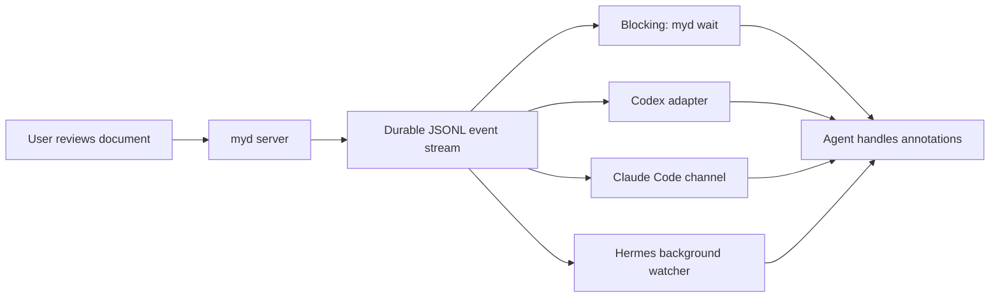

# myd Dual-Mode Review Events {#myd-dual-mode-review-events}

myd should support the same review lifecycle in two consumption modes:

1. **Blocking:** an agent calls `myd view FILE --wait` and the tool returns when the review completes.
2. **Triggered:** an agent or orchestration adapter subscribes to a durable event source and starts or resumes an agent turn when the review completes.

Both modes must use one underlying event contract. A WebSocket may improve live UI latency, but it must not be the source of truth.



## Portable event contract {#event-contract}

Opening a review should return structured data such as:

```json
{
  "url": "http://localhost:7474/?path=…&review=rev_123",
  "document": "/absolute/path/doc.md",
  "reviewId": "rev_123",
  "events": {
    "path": "/shared/state/myd/events/rev_123.jsonl",
    "cursor": 184
  }
}
```

The event file is append-only JSONL with a monotonically increasing sequence number:

```json
{"seq":185,"type":"annotation.changed","reviewId":"rev_123","document":"/absolute/path/doc.md","at":"…"}
{"seq":186,"type":"review.completed","reviewId":"rev_123","document":"/absolute/path/doc.md","at":"…"}
```

Important invariants:

- The event path is on a filesystem visible to the server and its agents; notification must not depend on agents sharing the server's `localhost` namespace.
- Capturing the cursor and establishing the review are one logical operation, so completion cannot fall into a setup race.
- Events are never consumed globally. Each waiter keeps its own cursor, allowing any number of agents to observe the same completion.
- The log survives server and agent restarts. Reconnecting from a cursor replays missed events before following new ones.
- Events contain routing metadata, not annotation content. An agent reads the document through normal permissions after it is awakened.
- Event files use restrictive permissions and bounded retention.

For one document, concurrent `view` calls should join the same active review cycle and receive the same `reviewId`. Clicking **Done Reviewing** closes that cycle and awakens every subscriber. A later `view` creates a new cycle, preventing an old completion event from satisfying a new wait.

## CLI surface {#cli-surface}

```text
myd view FILE --json
myd view FILE --wait [--timeout SECONDS] --json
myd events FILE --review REVIEW_ID --after CURSOR [--follow] --json
myd watch-path FILE --review REVIEW_ID --json
```

`view --wait` should be implemented as a consumer of the durable event stream, not as a special WebSocket-only path. `events --follow` provides a portable stdout stream for supervisors. `watch-path` exposes the absolute file path for runtimes with native file watching.

The blocking result should include the matching completion event and current annotation summary. If the server cannot be reached but the event stream remains visible, an already-established wait can still complete.

## Runtime adapters {#runtime-adapters}

### Codex

Codex configuration has outbound notification commands, but an external myd event needs an inbound control surface. A small adapter can own a Codex app-server connection, retain the target thread ID, and translate `review.completed` into `thread/resume` followed by `turn/start`; if a turn is already active, it can choose `turn/steer` or queue until idle. The official app-server protocol exposes persisted threads and these turn controls: [Codex app-server](https://learn.chatgpt.com/docs/app-server).

The blocking CLI remains available when Codex is actively executing a turn. The app-server adapter is required when myd must awaken an idle Codex thread after that turn has ended.

### Claude Code

Claude Code can watch files with `FileChanged` hooks, but their `systemMessage` is primarily a terminal notification rather than a general model wake mechanism. Its purpose-built inbound surface is a custom MCP **channel**, which can push external events into an open session so Claude reacts while the user is away: [Claude Code channels](https://code.claude.com/docs/en/channels). The myd adapter should therefore expose `review.completed` as a channel event. A FileChanged hook remains a lightweight fallback for notification-only use.

Claude Code sessions must remain open for channel delivery. For a session that may exit, the event cursor lets a new session replay unhandled completions.

### Hermes

Hermes already has the closest native fit: start `myd events … --follow` or `myd view … --wait` with `terminal(background=true, notify_on_complete=true)`. Its gateway watcher detects process completion and triggers a new agent turn. The adapter should return the review event JSON on stdout so Hermes receives a compact, structured completion payload. Hermes' process tools can also block or poll when a synchronous flow is desired.

## Delivery sequence {#delivery-sequence}

1. Define and test the event schema, cursor semantics, active-review lifecycle, and retention policy.
2. Make `view --json` return `reviewId`, event path, and cursor.
3. Write completion and annotation-change events durably before broadcasting them.
4. Reimplement `view --wait` on the event stream and retain WebSockets only for live refresh.
5. Add concurrency and restart tests: multiple waiters, multiple documents, completion between setup steps, server restart, agent restart, and network-namespace isolation.
6. Add thin adapters in this order: Hermes background completion, Claude Code channel, Codex app-server.

## Acceptance tests {#acceptance-tests}

- Two agents wait on the same review; one click releases both with the same completion sequence.
- Agents wait on different documents without cross-delivery.
- An agent starts watching after completion and replays it from its earlier cursor.
- Killing the waiting agent does not lose the event; a replacement resumes from the cursor.
- The myd HTTP server lives outside an agent's network namespace, while file-based waiting still completes.
- Reopening a completed document creates a new review ID and does not reuse the previous completion.
- Every runtime adapter receives the same canonical event payload and records its acknowledgement independently.

## Product boundary {#product-boundary}

myd can publish durable events and provide blocking consumers. It cannot, by itself, awaken an agent runtime that offers no inbound turn API. That final hop belongs to a small runtime adapter. Keeping the event contract runtime-neutral makes the review protocol useful to Codex, Claude Code, Hermes, shell scripts, and future agents without embedding their session models into myd core.
