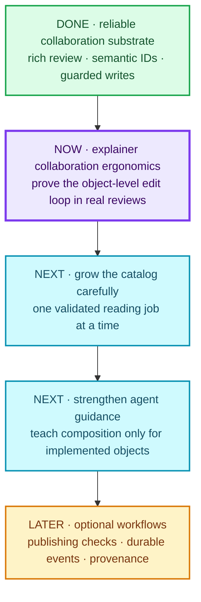

# mydraft roadmap {#title}

> [!IMPORTANT]
> **North star:** make human–agent collaboration across domains flexible and convenient. A human should be able to understand and annotate a meaningful part of a document; an agent should be able to find and revise that exact source object without rebuilding the page or imposing workflow metadata the document does not need.

The priority order is fixed by [ADR 0003](../docs/decisions/0003-prioritize-collaboration-ergonomics.md): collaboration substrate → domain-neutral object catalog → agent guidance → optional workflow capabilities.

## At a glance {#at-a-glance}

## Done: the foundation is credible {#done}

- Markdown remains the source; GFM, math, code, Mermaid, Vega, native explainers, and sandboxed HTML render richly.
- Humans can annotate text, blocks, diagrams, and semantic explainer objects; comments, suggestions, replies, resolutions, and review revisions round-trip through the source.
- HTML islands have a narrow bridge for sizing, theme, click-away behavior, and identified object comments.
- Native explainer v0 supports `timing`, `measurements`, and `result`, including validation against silently global timing signals.
- Agents can inventory, inspect, and guardedly replace one native object with `myd objects`, `myd object`, and `myd set-object`. A small semantic diff names changed scalar fields by stable object ID.
- CLI and HTTP document writers now cross one guarded mutation seam that freshly reads canonical Markdown, applies operation-appropriate version checks, writes atomically, and returns consistent versions and conflicts.
- The viewer has the ergonomic baseline now expected of every feature: light/dark mode, responsive layouts, a collapsible comments rail, click-away dismissal, nonblocking handoff, and reply drafts that survive live reloads.
- `myd publish` has a deliberately thin transaction core: immutable local releases, standalone HTML, a manifest and archive index, validation before promotion, and concurrency protection. Generated releases remain outside Git by default.

## Now: validate the complete object-edit loop {#now}

Use the current semantic-object explainer as the acceptance document. Complete one or more real review rounds in which:

1. the human can discover and comment on a specific visual object on desktop and a narrow screen;
2. `myd comments` reports the same stable `block›target` identity;
3. the agent inspects and changes only that object's YAML mapping;
4. the page updates without losing comments, drafts, focus, or review state; and
5. the revised explanation is materially easier to understand—not merely more colorful.

The current human review is the limiting input. Until it reveals a repeated problem, prefer fixes, tests, and simplification of this loop over adding abstractions.

> [!NOTE]
> **Immediate next decision:** after the current review, identify the single largest remaining collaboration friction. Fix that friction or add one object type only if the review demonstrates that the existing catalog cannot express the reading job cleanly.

## Next: grow only what earns its place {#next}

### Domain-neutral object catalog

Candidate reading jobs include comparison, flow or sequence, timeline, relationship, decision, metric, card, and callout. A candidate enters the shared catalog only when:

- a real document cannot be expressed clearly with Markdown or the existing three types;
- the same reading job appears in at least two materially different domains or document kinds;
- it has a stable source identity that supports precise annotation and targeted revision; and
- its responsive and light/dark behavior can be tested without per-document CSS.

Add one type at a time. Do not build the entire candidate list speculatively.

### Agent ergonomics and guidance

- Keep the myd skill synchronized with the actual catalog.
- Teach selection: plain Markdown first, native objects for reusable semantic structure, sandboxed HTML for genuinely custom visuals.
- Add short composition guidance for hierarchy, density, mobile layout, and qualification placement.
- Validate whether object-level edits reduce revision size or failure rate before claiming token or productivity savings.

### Review-relative change visibility {#change-visibility}

Carry forward Proof’s strongest human-facing question: **what changed since this review opened?** Start with a compact summary of changed named blocks and semantic objects when a real multi-step review demonstrates uncertainty. Do not pre-commit to a general snapshot store, revision picker, or rollback UI; add those only if the summary proves useful but insufficient.

## Later: optional workflow capabilities {#later}

These remain useful, but they do not organize the core product:

- external value/model references and exact-value consistency checks;
- link, citation, contrast, and responsive-layout checks;
- deterministic screenshots and a readable semantic source-diff experience;
- a durable event journal when a runtime adapter or observed restart loss needs replay;
- idempotency and machine-readable protocol discovery when a retrying client or second external adapter exists;
- deeper snapshot history or rollback if a minimal review-relative change summary proves insufficient;
- optional capabilities when the server becomes remote or multi-user;
- optional provenance, authorship, archival, and collaboration history for shared or published artifacts; and
- interaction recipes or evidence-driven component discovery.

Extend the existing publish transaction only when a real delivery workflow needs one of these. Ordinary and ephemeral documents must remain first-class without them.

## Guardrails {#guardrails}

- **Keep the source simple.** Markdown is the container, not the styling language; rich fences supply visual structure when useful.
- **Keep the core domain-neutral.** Domain conventions belong primarily in progressively loaded skill guidance.
- **Preserve the escape hatch.** Native objects are preferred when they fit; sandboxed HTML remains available when they do not.
- **Require evidence for breadth.** Two contexts before generalizing a catalog object; one concrete workflow before expanding optional infrastructure.
- **Build deep seams, not borrowed platforms.** Centralize behavior already duplicated across real callers; do not import a protocol surface for hypothetical integrations.
- **Protect attention.** Review handoff is asynchronous by default. Never poll an idle review; explicit synchronous waits have a fixed ceiling of 30 minutes.
- **Do not review generated noise.** Generated HTML and publish archives are disposable/local; review source and semantic changes.

## Related records {#records}

- [ADR 0003: collaboration ergonomics before workflow specialization](../docs/decisions/0003-prioritize-collaboration-ergonomics.md)
- [ADR 0004: selective adoption of Proof’s mutation discipline](../docs/decisions/0004-adopt-proof-discipline-selectively.md)
- [Collaboration domain language](../CONTEXT.md)
- [Original annotatable-explainer plan and review history](annotatable-visual-explainers.md)
- [Deferred dual-mode review-event design](myd-dual-mode-review-events.md)

---
comments:
  c1:
    body: go ahead, break down into pieces, have 5.6 luna agents implement
    by: user
    at: 2026-08-17T21:55:43.809Z
